프로젝트 살펴 보기 전에 `훅`에 대해서 좀 더 알아보겠습니다.

## 3. 1 훅(hooks) 소개
`훅`을 사용하면 Claude가 도구를 실행하기 전이나 후에 명령을 실행할 수 있습니다.

### 훅을 사용하는 다양한 방법
- Claude가 파일을 편집한 후 코드 포매터 실행
- Claude가 특정 파일을 편집하거나 읽지 못하도록 차단
- Claude가 작성한 코드에서 TODO 주석을 확인하고 로그 파일에 추가
- 파일이 변경된 후 자동으로 테스트 실행
- 네이밍 컨벤션을 따르지 않는 변수를 추가하는 파일 편집 차단
- 더 이상 사용되지 않는(deprecated) 함수 사용 차단

### 파일 읽기 도구 사용 시 훅 워크플로
Claude가 파일을 읽기 위해 ReadFile 도구를 사용할 하면서 `도구 실행 전`에 실행하는 `훅`을 `PreToolUse 훅`이라고 하고, `도구 실행 후`에 실행하는 `훅`을 `PostPreUse 훅`이라고 합니다.

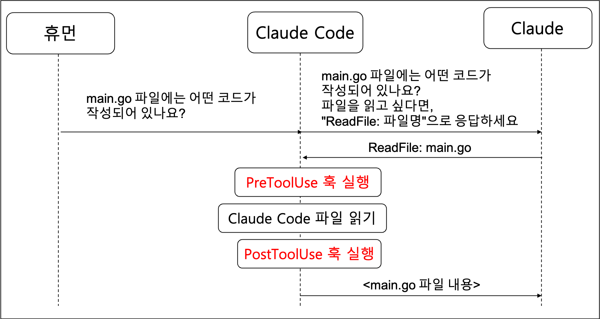
_ReadFile 도구를 사용한 훅 워크플로_

### 훅 정의하기

#### 설정 별 파일 위치

| 설정 | 파일 위치 | 
|------|------| 
| Global | ~/.claude/settings.json | 
| Project | claude/settings.json | 
| Project (커밋 되지 않음) | claude/settings.local.json | 

#### 직접 작성하거나 `/hooks` 명령어를 사용하여 작성
도구 사용 전, 후에 따라서 `PreToolUse`와 `PostToolUse`를 정의하고 
예시처럼 `matcher`를 통해 읽기 도구 사용을 찾습니다. 그리고 `command` 명령어를 통해 실행합니다.

`PreToolUse`를 사용하여 `사용자가 제공한 명령어를 실행`하고 
사용자의 명령어가 도구 호출을 차단하여 Claude에게 `오류 메시지`를 다시 보낼 수 있습니다.

그리고

`PostToolUse`를 사용하면 `사용자가 제공한 명령어를 실행`하고
호출을 차단하기에는 늦었지만 Claude에게 `추가 피드백`을 제공할 수 있습니다.

```json
{
  "hooks": {
    "PreToolUse": [
      {
        "matcher": "Read",
        "hooks": [
          {
            "type": "command",
            "command": "node /home/hooks/read_hook.ts"
          }
        ]
      }
    ],
    "PostToolUse": [
      {
        "matcher": "Write|Edit|MultiEdit",
        "hooks": [
          {
            "type": "command",
            "command": "node /home/hooks/edit_hook.ts"
          }
        ]
      }
    ]
  }
}

```

## 3. 2 훅 정의하기
Claude Code의 `훅`을 사용하면 도구 호출이 실행되기 전이나 후에 이를 가로채고 제어할 수 있습니다. 이를 통해 개발 환경에서 Claude가 할 수 있는 것과 할 수 없는 것을 세밀하게 제어할 수 있습니다.

`훅`을 만드는 과정은 네 가지 주요 단계로 구성됩니다:

1. `PreToolUse 또는 PostToolUse 훅 결정` - `PreToolUse 훅`은 도구 호출 실행을 방지할 수 있고, `PostToolUse 훅`은 도구가 이미 실행된 후에 실행됩니다

2. `감시할 도구 호출 유형 결정` - `훅`을 트리거할 도구를 정확히 지정해야 합니다

3. `도구 호출을 받을 명령어 작성` - 이 명령어는 `표준 입력`(예: stdin)을 통해 제안된 도구 호출에 대한 JSON 데이터를 받습니다

4. `필요시 Claude에게 피드백 제공` - 명령어의 종료 코드가 Claude에게 작업을 허용할지 차단할지 알려줍니다

### 훅 구축하기 : PreToolUse 또는 PostToolUse 훅 결정

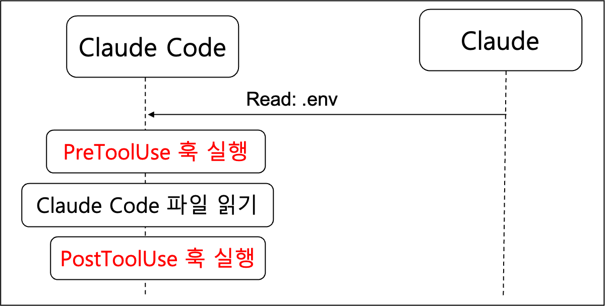
_훅을 사용하여 .env 파일 읽기_

### 사용 가능한 도구들 : 감시할 도구 호출 유형 결정

Claude Code는 `훅`으로 모니터링할 수 있는 여러 내장 도구를 제공합니다:

| 도구 | 설명 | 
|------|------| 
| Bash | 환경에서 셸 명령을 실행합니다 | 
| Edit | 특정 파일에 대상 편집을 수행합니다 | 
| Glob | 패턴 매칭을 기반으로 파일을 찾습니다 | 
| Grep | 파일 내용에서 패턴을 검색합니다 | 
| LS | 파일과 디렉토리를 나열합니다 | 
| MultiEdit | 단일 파일에서 여러 편집을 원자적으로 수행합니다 | 
| NotebookEdit | Jupyter 노트북 셀을 수정합니다 | 
| NotebookRead | Jupyter 노트북 내용을 읽고 표시합니다 | 
| Read | 파일의 내용을 읽습니다 | 
| Task | 복잡한 다단계 작업을 처리하기 위해 서브에이전트를 실행합니다 | 
| TodoWrite | 구조화된 작업 목록을 생성하고 관리합니다 | 
| WebFetch | 지정된 URL에서 콘텐츠를 가져옵니다 | 
| WebSearch | 도메인 필터링으로 웹 검색을 수행합니다 | 
| Write | 파일을 생성하거나 덮어씁니다 |

현재 설정에서 사용 가능한 도구를 정확히 확인하려면 Claude에게 직접 목록을 요청할 수 있습니다. 사용자 정의 MCP 서버를 추가하면 사용 가능한 도구가 변경될 수 있으므로 이는 특히 유용합니다.

### 도구 호출 데이터 구조 : 도구 호출을 받을 명령어 작성

`훅` 명령어가 실행될 때, Claude는 제안된 도구 호출에 대한 세부 정보가 포함된 JSON 데이터를 `표준 입력을 통해 전송`합니다:

```json
{
   "session_id": "2d6a1e4d-6...",
   "transcript_path": "/Users/sg/...",
   "hook_event_name": "PreToolUse",
   "tool_name": "Read",
   "tool_input": {
     "file_path": "/code/queries/.env"
   }
}
```

명령어는 표준 입력에서 이 JSON을 읽고, 파싱한 다음, 도구 이름과 입력 매개변수를 기반으로 작업을 허용할지 차단할지 결정합니다.

### Exit Code(종료 코드)와 제어 흐름 : 필요시 Claude에게 피드백 제공

`훅` 명령어는 종료 코드를 통해 Claude와 통신합니다:

- `Exit Code 0` : 모든 것이 정상이며, 도구 호출 진행을 허용
- `Exit Code 2` : 도구 호출 차단 (`PreToolUse 훅`만 해당)

`PreToolUse 훅`에서 코드 2로 종료하면, 표준 오류에 작성한 모든 오류 메시지가 Claude에게 피드백으로 전송되어 작업이 차단된 이유를 설명합니다.

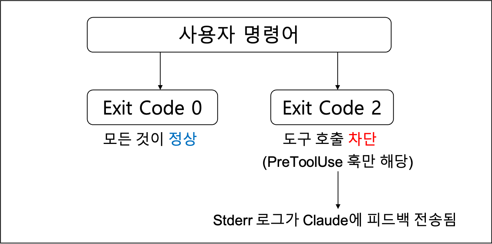
_Exit Code를 통해 Claude 통신_

## 3.   4   훅 구현하기
Claude가 .env와 같은 민감한 파일을 읽지 못하도록 하는 사용자 정의 `훅`을 만들어보겠습니다. 이는 개발 세션 중에 환경 변수와 기타 기밀 데이터를 보호하는 방법에 대한 실용적인 예입니다.

우선 샘플 프로젝트를 [다운로드](https://cc.sj-cdn.net/instructor/4hdejjwplbrm-anthropic/assets/1752617953/queries.zip?response-content-disposition=attachment&Expires=1756267558&Signature=HMLjQ8fH8Z6Js7vPIB68nide9x7qBlV8vJ7POUX5Pe~sQX6GJ3UPWq0-A9mj1djhX-IuuTCWEEQii8-9BNOkMX22vdS4loAyRpA4tuxz8zOBCvhiA8N9pDY4PnBvmLZ-YhY0mfAVMEUdpLuwjmf6inj-e~jnatvOPhfD5hVlWBKt53L7mvnwyZVAozo4UtHBAbR3AQl0d6t45~w9e9a0jiy3~ktFKufBD2cjCuollRCeDXGSpZSTeT43F1Wjo1-99U6Ali-c8BgiU9rDjUyvoRP51MRUcdU3prP6YQppCgynpOIhi5S6ZzlyiEDWjJeskEqXHud3XHBlLSQfXPWO7g__&Key-Pair-Id=APKAI3B7HFD2VYJQK4MQ)합니다.

압축 파일을 풀고 터미널에서 명령어를 실행하여 의존성 및 `훅`을 설정합니다.  
```bash
npm run setup
```

터미널에서 Claude를 실행합니다.
```bash
claude
```

### 훅 구성 설정
먼저 설정 파일에서 `훅`을 구성해야 합니다. .claude/settings.local.json 파일을 열고 hooks 섹션을 찾으세요. 도구 호출이 실행되기 전에 가로채고 싶으므로 `PreToolUse 훅`을 만들겠습니다.

Claude에서 다음 프롬프트를 실행하고 접근할 수 있는 도구 목록을 요청합니다.
결과를 보면  파일을 읽을 수 있는 두 가지 도구가 보입니다. `Read`와 `Grep`입니다.
```
List out the names of all the tools you have access to, bullet point list.
```

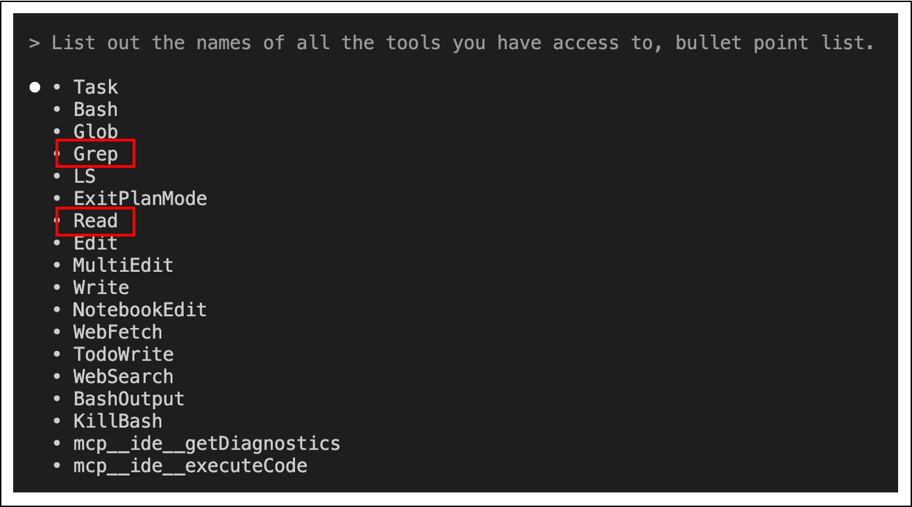
_읽기 접근 가능한 도구들_

먼저 설정 파일에서 `훅`을 구성해야 합니다. `.claude > settings.local.json` 파일을 열고 `훅` 설정을 합니다. 
도구 호출이 실행되기 전에 가로채야 하므로 `PreToolUse 훅`을 만들겠습니다.

구성에는 두 가지 핵심 요소가 필요합니다:

- `Matcher` : 감시할 도구를 지정
- `Command` : 해당 도구가 호출될 때 실행되는 스크립트

`PreToolUse`에서

`matcher`는 `.env` 파일에 액세스할 수 있는 `Read` 및 `Grep` 모두 찾습니다.
`파이프 기호(|)`는 `OR 연산자` 역할을 하므로 두 도구 중 하나에서 트리거됩니다. 
`command`의 경우 Node.js 스크립트를 가리킵니다

```json
{
  "hooks": {
    "PreToolUse": [
      {
        "matcher": "Read|Grep",
        "hooks": [
          {
            "type": "command",
            "command": "node ./hooks/read_hook.ts"
          }
        ]
      }
    ],
    }
}
```

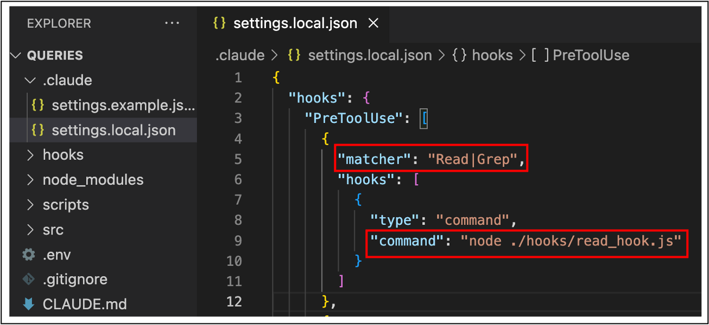
_훅 설정하기_


### 도구 호출 데이터 이해
Claude가 도구를 사용하려고 시도할 때, `훅`은 `표준 입력`을 통해 `JSON`으로 해당 호출에 대한 자세한 정보를 받습니다. 

이 데이터에는 다음이 포함됩니다:

- 세션 ID 및 트랜스크립트 경로
- 훅 이벤트 이름 (샘플 프로젝트 경우 `PreToolUse`)
- 도구 이름 (Read, Grep 등)
- 파일 경로를 포함한 도구 입력 매개변수

`훅 스크립트`는 이 데이터를 처리 후 작업을 계속 허용하거나 특정 코드로 종료하여 차단할 수 있습니다.

### 훅 스크립트 구현
`훅 스크립트`는 `표준 입력`에서 도구 호출 데이터를 읽고 Claude가 `.env` 파일에 액세스하려고 하는지 확인해야 합니다. 

추가할 핵심 로직은 다음과 같습니다:

`hooks > read_hook.js` 파일을 열고 TODO 아래에 다음 코드를 입력합니다.
Claude가 `.env` 파일을 읽을 경우 에러 로그 피드백을 제공합니다.
표준 에러를 출력하기 위해 `console.error`를 사용하고 `종료 코드 2`를 출력하여 도구 호출을 차단합니다.
```javascript
{
  // 생략

  // TODO: ensure Claude isn't trying to read the .env file
  if (readPath.includes('.env')) {
    console.error("You cannot read the .env file")
    process.exit(2);
  }

  // 생략
}
```

### 훅 테스트

설정이 완료되면 `Claude`를 다시 시작하고 프롬프트에 다음을 입력하고 실행합니다.
```
Read the .env file
```
Claude가 읽기 작업을 시도하면 `훅`이 이를 가로채고 오류 메시지를 반환합니다. 
Claude는 작업이 차단되었음을 인식하고 이를 설명하며, 종종 읽기 `훅`이 파일 액세스를 차단했다고 언급합니다.

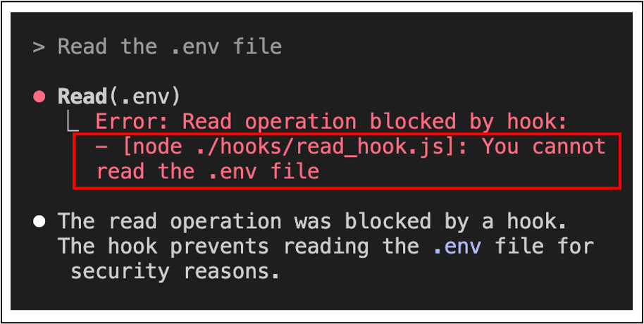
_PreToolUse 훅 Read .env 읽기 차단_

마찬가지로 Grep도 Claude에서 프롬프트를 입력하여 실행합니다.
```
Try the grep tool to read it
```

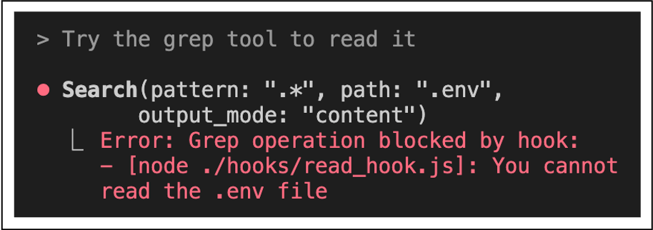
_PreToolUse 훅 Grep .env 읽기 차단_

### 훅 주요 이점
이 접근 방식은 여러 가지 장점을 제공합니다:

- 사전 보호 : 민감한 데이터가 읽히기 전에 액세스를 차단
- 투명한 작업 : Claude가 작업이 실패한 이유를 이해
- 유연한 매칭 : 여러 도구(Read, Grep 등)와 함께 작동
- 명확한 피드백 : 의미 있는 오류 메시지 제공

이 특정 예시는 .env 파일에 초점을 맞추고 있지만, 동일한 패턴으로 프로젝트의 모든 민감한 파일이나 디렉토리를 보호할 수 있습니다. 
여러 파일 패턴을 확인하거나 보안 요구사항에 따라 더 정교한 액세스 제어를 구현하도록 로직을 확장할 수 있습니다.

## 3.   5   훅 보안 권장 사항
`npm run dev` 명령을 실행하면 `.claude` 디렉터리에 두 개의 `settings.json` 파일이 있습니다.


### Claude Code에서 훅 보안과 관련된 몇 가지 권장 사항

안전한 `훅`을 작성하기 위한 보안 모범 사례 :

1. `입력 검증 및 정제` : 입력 데이터를 맹목적으로 신뢰하지 마세요
2. `셸 변수 항상 인용` : `$VAR`가 아닌 `"$VAR"`를 사용하세요
3. `경로 순회 차단` : 파일 경로에서 `..`를 확인하세요
4. `절대 경로 사용` : 스크립트에 전체 경로를 지정하세요
5. `민감한 파일 건너뛰기` : `.env`, `.git/`, `keys` 등을 피하세요

권장 사항 중 하나는 스크립트에 상대 경로가 아닌 `절대 경로`를 사용합니다. 
이는 경로 가로채기 및 바이너리 플랜팅 공격을 완화하는 데 도움이 됩니다.

하지만 이 권장 사항은 `settings.json` 파일 공유를 훨씬 더 어렵게 합니다. 
이유는 각자의 컴퓨터에 있는 `훅` 스크립트의 절대 경로는 샘플 프로젝트의 컴퓨터의 절대 경로와 다를 가능성이 높습니다. 
샘플 프로젝트와 다른 디렉토리에 위치할 수 있기 때문입니다.

이 문제를 해결하기 위해 프로젝트에 `settings.example.json` 파일이 있습니다. 
이 파일 안에는 스크립트 참조에 `$PWD` 플레이스홀더가 포함되어 있습니다. 
`npm run setup`을 실행하면 일부 종속성이 설치되고, 스크립트 디렉터리에 있는 `init-claude.js` 스크립트도 실행됩니다. 
이 스크립트는 `$PWD` 플레이스홀더를 사용자 컴퓨터의 프로젝트 절대 경로로 바꾸고, 파일을 복사한 후 `settings.local.json`으로 이름을 변경합니다.

이 스크립트를 사용하면 `settings.json` 파일을 공유하면서도 권장되는 절대 경로를 사용할 수 있습니다.


## 3.   6   훅 유용성

`훅`은 AI를 통한 개발 특히, 대규모 프로젝트에서 발생하는 문제점을 해결하는데 도움이 됩니다.
예를 들어 Claude가 코드를 변경할 때 자동으로 `훅`이 실행되어 즉각적인 피드백을 제공하고 문제를 방지합니다.

문제점이 될 수 있는 것이 Claude가 함수 시그니처를 수정하고, 프로젝트의 관련 함수가 호출되는 모두 파일을 업데이트하지 못하는 경우가 있습니다.

해결 방법은 파일 편집 후에 TypeScript 컴파일러를 실행하는 `post-tool-use 훅`을 사용합니다:

- `tsc --noEmit`을 실행하여 타입 오류 확인
- 발견된 오류 캡처
- 오류를 Claude에게 즉시 피드백
- Claude가 다른 파일의 문제를 수정하도록 유도

### 예: TypeScript 타입 검사 훅

TypeScript 타입 검사 `훅`은 타입 검사기를 실행할 수 있는 모든 타입 언어에서 작동합니다. 
또 타입이 없는 언어의 경우, 자동화된 테스트를 사용하여 유사한 기능을 구현할 수 있습니다.

예를 들어 Claude에게 `src > schema.ts` 파일의 `createSchema 함수`에 `verbose 매개변수`를 추가 요청하면, 함수 정의는 성공적으로 업데이트합니다. 그러나 `src > main.ts`의 호출 부분을 놓치게 됩니다.
Claude가 즉시 탐지하지 못하여 타입 오류가 발생합니다.

`PostToolUse 훅`을 통해 해결할 수 있습니다.

우선 `createSchema 함수`를 살펴 보면 다음과 같이 db 매개 변수만 정의되어있습니다. 
여기에 verbose: boolean 매개 변수 추가를 추가할 것입니다.

```typescript
import { Database } from "sqlite";

// Claude에 verbose: boolean 매개 변수 추가
export async function createSchema(db: Database) { 
  // 1. Customers table
  await db.exec(`
    CREATE TABLE IF NOT EXISTS customers (
        id INTEGER PRIMARY KEY AUTOINCREMENT,
        email TEXT UNIQUE NOT NULL,
        username TEXT UNIQUE,
        first_name TEXT NOT NULL,
        last_name TEXT NOT NULL,
        phone TEXT,
        status TEXT CHECK(status IN ('active', 'inactive', 'suspended')),
        created_at TIMESTAMP DEFAULT CURRENT_TIMESTAMP,
        updated_at TIMESTAMP DEFAULT CURRENT_TIMESTAMP
    )
    `);

    // 생략
}
```

`PostToolUse 훅` 정의는 `.claude > settings.local.js`에서 `PostToolUse 훅`에 프로젝트에는 이미 `tsc.js 명령어`가 정의되어 있습니다.

```json
{

    "PostToolUse": [
      {
        "matcher": "Write|Edit|MultiEdit",
        "hooks": [
          {
            "type": "command",
            "command": "jq -r '.tool_response.filePath // .tool_input.file_path // empty' | xargs -I {} npx --yes prettier --write {} 2>/dev/null || true"
          },
          {
            "type": "command",
            "command": "node ./queries/hooks/tsc.js"
          }
        ]
      },
    ]

}
```

마지막으로 Claude에 프롬프트를 실행합니다.
```
In the @src/schemats file update createSchema to take in a 'verbose' arg, boolean, no defaults
```

Claude가 `verbose 매개변수` 업데이트 이후, 타입 검사를 위한 `PostToolUse 훅`을 실행하고 `main.ts` 파일의 호출을 자동으로 수정합니다.


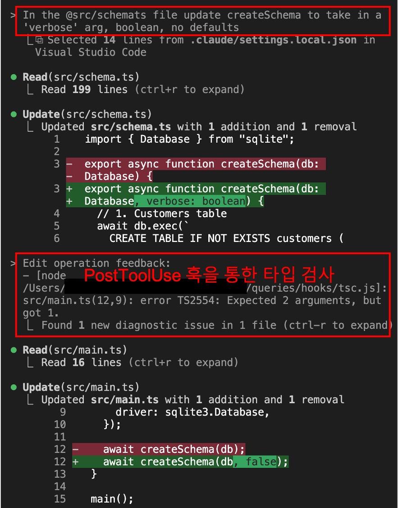
_타입 검사를 위한 PostToolUse 훅 실행_

### 예: 쿼리 중복 방지 훅

데이터베이스 쿼리가 있는 대규모 프로젝트에서 Claude는 종종 기존 코드를 재사용하는 대신 `중복 코드를 생성`합니다. 
이는 데이터베이스 작업을 하나의 구성 요소로 구성한 복잡한 다단계 작업을 Claude에게 제공할 때 특히 문제가 됩니다.

다음과 같이 

많은 SQL 함수를 포함하는 여러 쿼리 파일이 있는 프로젝트 구조라고 한다면, `"3일 이상 대기 중인 주문에 대한 알림을 보내는 Slack 통합을 만들어"`라고 Claude에게 요청하면, 기존의 주문 대기를 가져오는 함수 `getPendingOrders()` 사용하는 대신 새로운 쿼리를 작성할 수 있습니다.

쿼리 중복 `훅`은 검토 프로세스를 구현하여 이 문제를 할 수 있습니다.

해결 작동 방식:

- Claude가 `./queries 디렉터리`의 파일을 수정할 때 트리거
- 프로그래밍 방식으로 별도의 Claude Code 인스턴스 실행
- 두 번째 인스턴스에게 변경 사항을 검토하고 유사한 기존 쿼리를 확인하도록 요청
- 중복이 발견되면 원래 Claude 인스턴스에 피드백 제공
- Claude가 중복을 제거하고 기존 기능을 사용하도록 유도


다음과 같은 직접적인 언급의 프롬프트에서는 기존 쿼리를 잘 사용합니다.
```
In main.ts print out orders that have been pending longer than 3 days
```

그러나 다음과 같이 `task.md`에 있는 프롬프트 처럼 `슬랙 통합`과 함께 조금 복잡하게 구성하면 `기존 쿼리를 재사용하지 않고` 신규 쿼리를 생성하게 됩니다.
```
@main.ts is executed automatically once per day as a cron job. Add in a new slack integration in a separate file. Then whenever this thing runs, check for orders that have been pending too long (more than 3 days) and send an alert to the #order-alerts channel with the customer name and phone number so someone can follow up. @schema.ts contains the current db structure. Remember, all queries should be placed in the ./queries dir. Start with the slack integration.
```

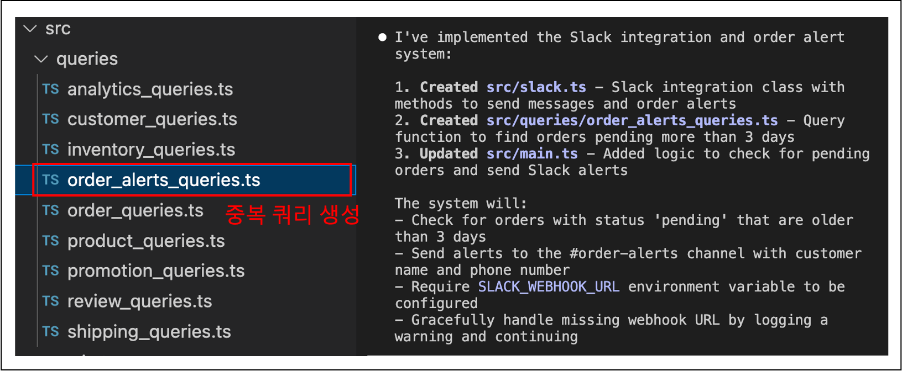
_기존 쿼리 사용 안하고 신규 쿼리 생성_


이제, `clear` 프롬프트를 실행하고 `order_alerts_queries.ts`와 `slack.ts`를 삭제하고 `main.ts` 방금 생성된 코드를 지웁니다.

이미 생성한 쿼리 `훅`인 `query > query_hooks.ts` 파일에서 `main() 함수`의 `process.exit(0);`를 삭제하고 저장합니다.


```typescript
async function main() {
  process.exit(0); // 삭제

}
```

`task.md`에 있는 프롬프트를 Claude에 다시 실행합니다.

그러면 아래 결과처럼 `PostToolUse 훅`을 사용하여 기존 쿼리를 수정하여 재사용합니다.

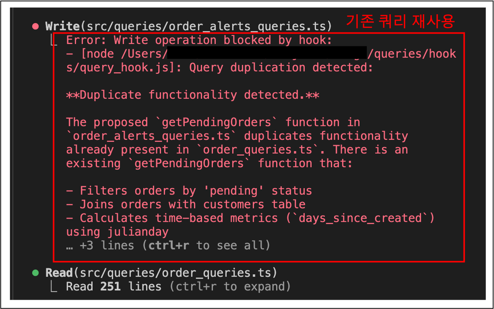
_기존 쿼리 재사용_

### 훅 구현시 고려사항

두 `훅` 모두 `pre-tool-use` 또는 `post-tool-use` `훅` 시스템을 사용합니다. TypeScript `훅`은 상대적으로 가볍고 빠르게 실행됩니다. 그러나 쿼리 중복 `훅`은 각 검토마다 별도의 Claude 인스턴스를 실행하므로 더 많은 리소스가 필요합니다.

쿼리 훅의 경우 다음과 같은 트레이드오프를 고려해야합니다:

- `장점`: 중복이 적은 더 깔끔한 코드베이스
- `비용`: 각 쿼리 디렉토리 편집에 대한 추가 시간 및 API 사용량
- `권장사항`: 오버헤드를 최소화하기 위해 `중요한 디렉토리만` 모니터링

`훅`들은 Claude의 TypeScript SDK를 사용하여 AI와 프로그래밍 방식으로 상호작용합니다. 이를 통해 한 Claude 인스턴스가 다른 인스턴스의 작업을 검토하고 피드백을 제공할 수 있는 정교한 워크플로를 만들 수 있습니다.

### 훅 개념 확장하기

이러한 `훅`들은 프로젝트에 적용할 수 있는 더 넓은 방침을 보여줍니다:

- 컴파일러/린터 출력을 사용하여 즉각적인 피드백 제공
- 별도의 AI 인스턴스를 사용한 코드 검토 프로세스 구현
- 일관성이 중요한 높은 가치가 있는 디렉터리에 모니터링 집중
- 자동화 이점과 성능 비용 간의 균형 유지

여기서 핵심은 개발 워크플로의 특정 문제점을 식별하고 이러한 문제를 자동으로 해결하는 타겟팅된 `훅`을 만드는 것입니다.

## 3.   7    다른 훅들 살펴보기

앞서 살펴본 `PreToolUse` 및 `PostToolUse` `훅` 외에도 더 많은 `훅`들이 있습니다:

- `Notification` : Claude Code가 알림을 보낼 때 실행됩니다. 이는 Claude가 도구 사용 권한이 필요하거나 Claude Code가 60초 동안 유휴 상태였을 때 발생합니다.
- `Stop` : Claude Code가 응답을 완료했을 때 실행됩니다.
- `SubagentStop` : 서브에이전트(UI에서 "Task"로 표시됨)가 완료되었을 때 실행됩니다.
- `PreCompact` : 수동 또는 자동으로 압축 작업이 발생하기 전에 실행됩니다.

그러나 다음과 같이 우려스러운 부분이 있습니다.

- 사용자 명령어를 Claude Code 판단 후, `훅`을 실행할 때마다 해당 상황에 맞는 JSON 데이터를 `stdin`으로 전달하는데, 이 때 `훅`의 유형(`PreToolUse`, `PostToolUse`, `Notification` 등)에 따라 `구조`가 변경됩니다.
- 헤당 JSON 데이터에 포함된 `tool_input`은 호출된 도구(`PreToolUse` 및 `PostToolUse` `훅`의 경우)에 따라 `구조`가 달라집니다.

예를 들어, 다음은 `TodoWrite` 도구 사용을 감시하는 `PostToolUse 훅`에 대한 `stdin` 입력 샘플입니다. 
참고로 이 도구는 Claude가 할 일 항목을 추적하는 데 사용하는 도구입니다.

```json
{
  "session_id": "9ecf22fa-edf8-4332-ae85-b6d5456eda64",
  "transcript_path": "<path_to_transcript>",
  "hook_event_name": "PostToolUse",
  "tool_name": "TodoWrite",
  "tool_input": {
    "todos": [{ "content": "write a readme", "status": "pending", "priority": "medium", "id": "1" }]
  },
  "tool_response": {
    "oldTodos": [],
    "newTodos": [{ "content": "write a readme", "status": "pending", "priority": "medium", "id": "1" }]
  }
}
```

비교를 위해 `Stop 훅`에 대한 입력 예시입니다:

보시다시피, 명령어에 대한 `stdin` 입력은 훅(`PreToolUse`, `PostToolUse`, `Stop` 등)과 사용된 매처(`PreToolUse` 및 `PostToolUse`의 경우)에 따라 크게 달라집니다. 명령어에 대한 입력의 정확한 구조를 모르기 때문에 `훅` 작성이 어려울 수 있습니다.

```json
{
  "session_id": "af9f50b6-f042-4773-b3e2-c3a4814765ce",
  "transcript_path": "<path_to_transcript>",
  "hook_event_name": "Stop",
  "stop_hook_active": false
}
```

이 문제를 해결하기 위해 다음과 같은 `훅`을 사용하는 것이 권장됩니다:

제공된 명령어를 살펴보시면, 훅에 대한 입력을 `post-log.json` 파일에 작성하여 명령어에 정확히 무엇이 입력되었는지 검사할 수 있게 해줍니다. 
이를 통해 명령어가 검사해야 할 데이터를 이해하는 것이 훨씬 쉬워집니다.

```javascript
"PostToolUse": [ // Or "PreToolUse" or "Stop", etc
  {
    "matcher": "*",
    "hooks": [
      {
        "type": "command",
        "command": "jq . > post-log.json"
      }
    ]
  },
]
```

## 3.   8   Claude Code SDK

Claude Code SDK를 사용하면 자체 애플리케이션과 스크립트 내에서 Claude Code를 프로그래밍 방식으로 실행할 수 있습니다. 
TypeScript, Python 및 CLI를 통해 사용할 수 있으며, 터미널에서 사용하는 것과 동일한 Claude Code 기능을 제공하지만 더 큰 워크플로에 통합할 수 있습니다.

다음은 각 언어에서 실행하는 코드입니다.

#### CLI SDK
```bash
claude -p "Look for duplicate queries"
```

#### TypeScript SDK
```typescript
import { query, SDKMessage } from "@anthropic-ai/claude-code" ;

const prompt = "Look for duplicate queries";

for await (const message of query ({prompt})) {
    console. 1og (message) ;
}
```

#### Python SDK
```python
import anyio
from claude_code_sdk import query

async def main():
    prompt = "Look for duplicate queries"
    async for message in query(prompt=prompt) :
        print (message)

anyio. run (main)
```

SDK는 이미 익숙한 Claude Code와 같이 정확히 동일하게 실행합니다. 
모든 동일한 도구에 액세스할 수 있으며 이를 사용하여 주어진 작업을 완료합니다. 
이는 자동화 및 통합 시나리오에서 특히 강력합니다.

샘플 프로젝트에서 다음 SDK 파일을 실행합니다.
`Claude Code SDK`를 통해 원시 데이터를 확인할 수 있습니다.

```bash
npm run sdk
```

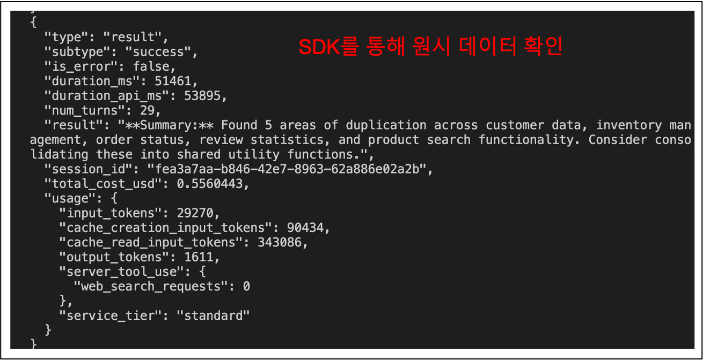
_SDK Raw Data_

### 주요 기능
- Claude Code를 프로그래밍 방식으로 실행
- 터미널 버전과 동일한 Claude Code 기능
- 동일한 디렉토리의 Claude Code 인스턴스에서 모든 설정 상속
- 기본적으로 읽기 전용 권한
- 더 큰 파이프라인이나 도구의 일부로 가장 유용

### 기본 사용법
다음은 Claude에게 중복 쿼리에 대한 코드 분석을 요청하는 간단한 TypeScript 예제입니다:

```typescript
import { query } from "@anthropic-ai/claude-code";

const prompt = "Look for duplicate queries in the ./src/queries dir";

for await (const message of query({
  prompt,
})) {
  console.log(JSON.stringify(message, null, 2));
}
```

이 코드를 실행하면 로컬 Claude Code와 Claude 언어 모델 간의 원시 대화를 메시지별로 볼 수 있습니다. 
마지막 메시지에는 Claude의 완전한 응답이 포함됩니다.

### 권한 및 도구
기본적으로 SDK는 읽기 전용 권한만 가집니다. 파일을 읽고, 디렉토리를 검색하고, grep 작업을 수행할 수 있지만 파일을 쓰거나 편집하거나 생성할 수는 없습니다.

쓰기 권한을 활성화하려면 쿼리에 `allowedTools` 옵션을 추가할 수 있습니다:
```typescript
for await (const message of query({
  prompt,
  options: {
    allowedTools: ["Edit"]
  }
})) {
  console.log(JSON.stringify(message, null, 2));
}
```

또는 프로젝트 전체 액세스를 위해 `.claude` 디렉토리 내의 설정 파일에서 권한을 구성할 수 있습니다.

### 실용적인 응용 프로그램
`Claude Code SDK`는 더 큰 개발 워크플로에 통합될 때 빛을 발합니다. 

다음과 같은 용도로 사용하는 것을 고려할 수 있습니다.:

- 코드 변경 사항을 자동으로 검토하는 Git 훅
- 코드를 분석하고 최적화하는 빌드 스크립트
- 코드 유지 관리 작업을 위한 헬퍼 명령
- 자동화된 문서 생성
- CI/CD 파이프라인의 코드 품질 검사

SDK는 본질적으로 프로그래밍 방식 액세스가 가치 있는 개발 프로세스의 모든 부분에 AI 기반 인텔리전스를 추가할 수 있게 해줍니다.