## 주간 매출 보고서 시나리오

### 페르소나 
- `분석 담당자` : ABCorp에 재직하며 팀의 보고서 및 분석을 지원
- `본인` : 분석 담당자의 요구 사항을 분석하여 n8n 기반 워크플로 구축

### 분석 담당자의 자동화 요구 사항

1. 분석 담당자는 `주간 매출 보고서`의 자동화를 요구
2. 조직의 주요 비즈니스 프로세스(예: 판매 또는 생산) 데이터를 관리하는 `기존 데이터 웨어하우스에서 판매 데이터를 수집`(ABCorp의 데이터웨어하우스에는 CSV 파일 내보내기는 없지만 `API를 제공`)
3. 각 판매 주문은 `처리 중` 또는 `예약 상태`
4. 모든 `예약된 주문`의 `합계를 계산`하여 `매주 월요일 정기적`으로 회사 `Discord에 공지`
5. 모든 처리 중인 `판매 내역`을 `스프레드시트로 작성`하여 `영업 관리자가 이를 검토`하고 고객 후속 조치가 필요한지 확인 필요


_주간 매출 보고서 시나리오_

## 1.   워크플로 설계

1. 데이터웨어하우스에서 관련 `데이터(주문 ID, 주문 상태, 주문 가치, 직원 이름)`를 가져옵니다.
2. 주문을 `상태(처리 중 또는 예약됨)별로 필터링`합니다.
3. 모든 `예약 주문의 총 합을 계산`합니다.
4. 회사의 `Discord 채널`에서 `예약된 주문`에 대해 팀원에게 알립니다.
5. 후속 조치를 위해 `Airtable에 처리 주문에 대한 세부 정보를 입력`하세요.
6. 이 워크플로를 `매주 월요일 아침에 실행`하도록 예약합니다.

분석 담당자의 워크플로에는 회사 데이터웨어하우스에서 두 개의 외부 서비스로 데이터를 보내는 작업이 포함됩니다.

ABCopr는 전에는 일반 기능(조건 필터링, 계산, 스케줄링)을 사용하여 데이터를 처리했습니다.
- [Discord](https://discord.com/)
- [Airtable](https://www.airtable.com/)

`n8n`을 사용하여 완성된 워크플로는 다음과 같습니다.

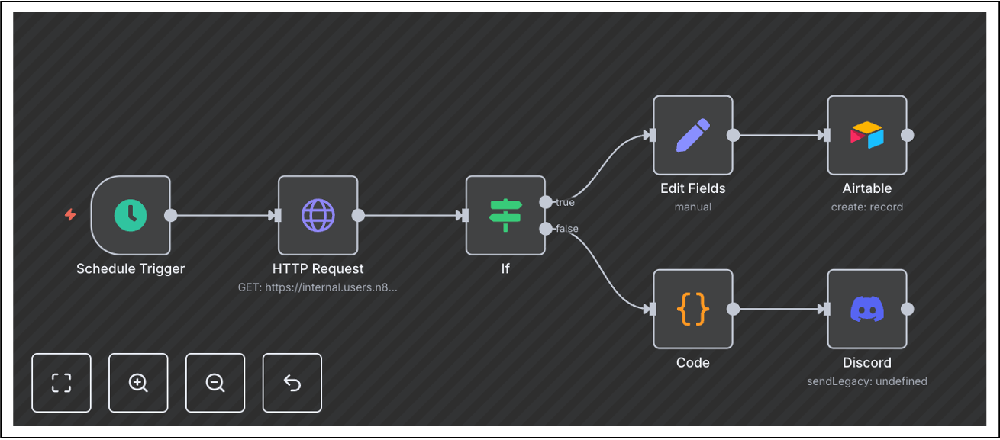
_완성된 워크플로_

이 워크플로는 8단계로 구성됩니다.

- 데이터웨어하우스에서 데이터 가져오기
- Airtable에 데이터 삽입
- 주문 필터링
- 주문 처리를 위한 값 설정
- 예약된 주문 계산
- 팀에 알리기
- 워크플로우 일정
- 워크플로 활성화 및 검토

## 2. 데이터웨어하우스에서 데이터 가져오기
워크플로의 `HTTP Request` 노드를 사용하여 HTTP 요청을 만들어 데이터를 가져오는 구성을 합니다.

이 섹션을 완료하면 워크플로는 다음과 같습니다.

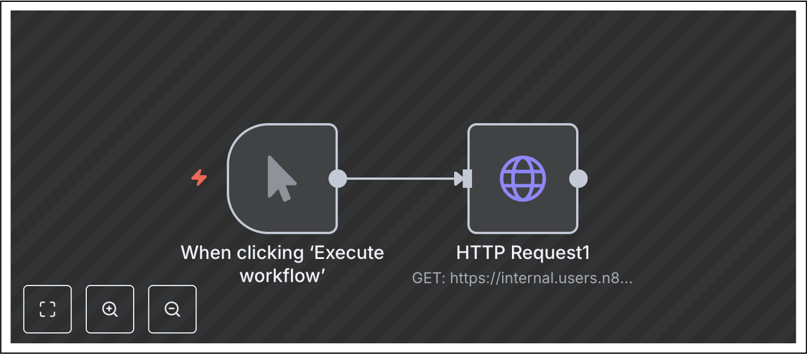
_데이터 가져오기 워크플로_

### 새로운 워크플로 생성하기
`Editor UI`를 열고 다음 두 가지 명령 중 하나를 사용하여 새 워크플로를 만듭니다.

- 키보드에서 `Ctrl + Alt + N` 또는 `Cmd + Option +N`을 선택합니다.
- 왼쪽 메뉴를 열고 `Workflows`로 이동한 다음 `Add Workflows`를 선택합니다.

이 새로운 워크플로의 이름을 "Nathan's workflow"로 지정합니다.

시나리오에서 데이터웨어하우스에서는 `n8n`에서 직접적으로 노드를 제공하지 않지만 `API`를 제공하기 때문에 `Http Request 노드`를 사용하여 데이터를 가져옵니다.

### HTTP Request 노드 추가
이제 `Editor UI`에서 노드 추가 단원에서 배운 대로 `HTTP Request` 노드를 추가합니다. 노드 창이 열리면 몇 가지 매개변수를 구성해야 합니다.

이 노드는 `자격 증명(Credential)`을 사용합니다.

n8n에서 보낸 이메일에 포함된 ABCorp 데이터웨어하우스 API 자격 증명이 필요합니다. 아직 등록하지 않으셨다면 [여기](https://n8n-community.typeform.com/to/PDEMrevI?typeform-source=docs.n8n.io)에서 등록하세요.

`HTTP Request `노드의 `Parameter`에서 다음과 같이 설정합니다.

- **Method** : 기본적으로 GET으로 설정해야 합니다.
- **URL** : 등록할 때 이메일로 받은 `Dataset URL`을 추가하세요.
- **Send Headers**: 이 컨트롤을 `true`로 설정합니다. `Specify Headers(헤더 지정)`에서 `Using Fields Below(아래 필드 사용)`로 선택합니다.
    - **Header Parameters** > **Name** : `unique_id`를 입력합니다.
    - **Header Parameters** > **Value** : 등록할 때 이메일로 받은 `Unique ID`입니다.
- **Authentication** : **Generic Credential Type(일반 자격 증명 유형)**을 선택합니다. 이 옵션을 선택하면 데이터 액세스를 허용하기 전에 자격 증명이 필요합니다.
    - **Generic Auth Type** : **Header Auth(헤더 인증)**을 선택합니다.(이 필드는 인증을 위한 Generic Credential Type을 선택한 후에 나타납니다.)
    - **Credential for Header Auth(헤더 인증을 위한 자격 증명)** : 자격 증명을 추가하려면 **+ Create new credential**를 선택합니다. 그러면 자격 증명 창이 열립니다.
    - 자격 증명 창에서 **Name(이름)**을 등록할 때 이메일로 받은 **Header Auth name(헤더 인증 이름)**으로 설정합니다.
    - 자격 증명 창에서 **Value(값)**를 등록할 때 이메일로 받은 **Header Auth value(헤더 인증 값)**으로 설정합니다.
    - 자격 증명 창에서 `Save` 버튼을 선택하여 자격 증명을 저장합니다. **Credentials Connection(자격 증명 연결)** 창은 다음과 같습니다.

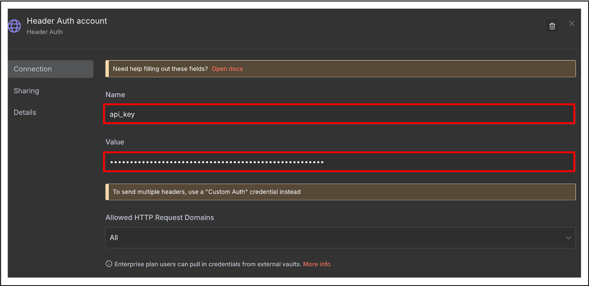
_신규 credential 설정_

저장한 후 자격 증명 창을 종료하여 `HTTP Request` 노드로 돌아갑니다.

### 데이터를 가져오기
`HTTP Request` 노드 창에서 `Execute step` 버튼을 클릭합니다. 

다음과 같이 HTTP 요청 결과 테이블 뷰가 출력됩니다.

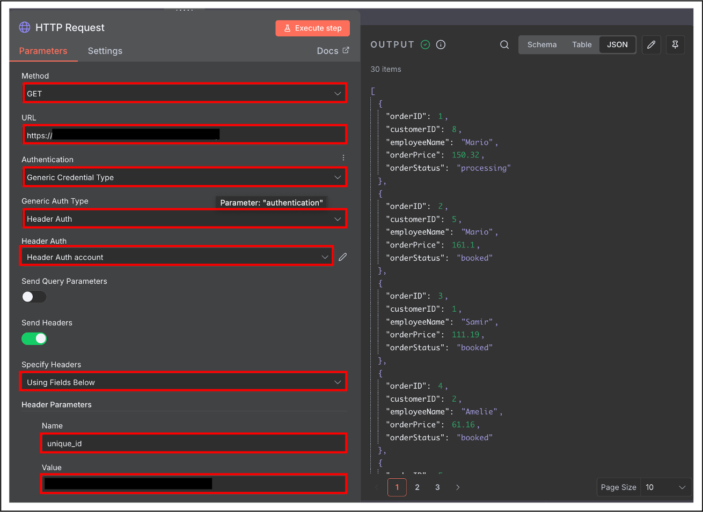
_Http Request 노드 설정 및 결과_

다음은 데이터 분석가가 작업해야 할 ABCorp 데이터 웨어하우스의 데이터입니다. 이 데이터 세트에는 5개 열로 30명의 고객에 대한 판매 정보가 포함되어 있습니다.

- `orderID`: 각 주문의 고유 ID입니다.
- `customerID`: 각 고객의 고유 ID입니다.
- `employeeName`: 고객을 담당하는 데이터 분석가의 동료 이름입니다.
- `orderPrice`: 고객 주문의 총 가격입니다.
- `orderStatus`: 고객의 주문 상태가 `booked` 또는 아직 `processing` 인지 여부.

## 3.   Airtable에 데이터 삽입
[Airtable](https://docs.n8n.io/integrations/builtin/app-nodes/n8n-nodes-base.airtable/) 노드를 사용하여 `HTTP Request` 노드에서 수신한 데이터를 `Airtable`에 삽입하는 방법을 알아봅니다.

이 단계를 마치면 작업 흐름은 다음과 같습니다.

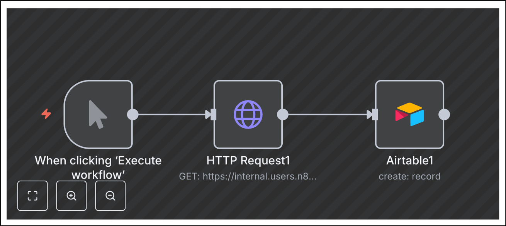
_Airtable 워크플로 구성_

### 테이블 구성
`Airtable`에 데이터를 삽입하려면 먼저 테이블을 설정해야 합니다. 방법은 다음과 같습니다.

1. [Airtable 계정을 생성합니다.](https://airtable.com/signup)
2. `Airtable` 작업 공간에서 처음부터 새 베이스를 추가하고 이름을 지정합니다(예: `beginner course`)
3. `beginner course` 베이스에는 기본적으로 `Name`, `Notes`, `Assignee`, `Status`의 네 개의 필드가 있는 `Table 1`이라는 테이블이 있습니다. (이 필드들은 `orders` 데이터 세트에 없으므로 관련이 없습니다.)

`Airtable`의 필드 이름은 노드 결과의 열 이름과 일치해야 합니다. 

다음과 같이 테이블을 준비합니다.

- 식별하기 쉽도록 `Table 1`의 표 이름을 `orders`로 변경합니다.
- 기본으로 생성된 3개의 빈 레코드를 삭제합니다.
- `Notes`, `Assignee`, 및 `Status` 필드를 삭제합니다.
- `Name` 필드(primary 필드)를 `orderID` 필드로 타입을 `Number`로 수정합니다.

아래 표를 참조하여 나머지 필드와 해당 필드 유형을 추가합니다.

| 필드 이름 | 필드 유형 | 
|------|------| 
| orderID  |  Number |
| customerID   |  Number |
| employeeName   |  Single line text |
| orderPrice  |  Number |
| orderStatus  |  Single line text |

완료하면 다음과 같습니다.

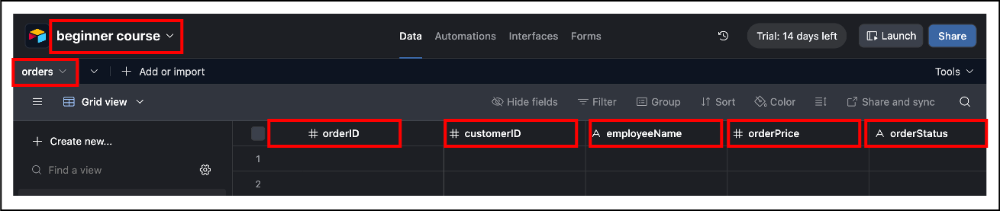
_Airtable 구성_

다시 `Editor UI`의 워크플로로 돌아갑니다.

### HTTP Request 노드에 Airtable 노드 추가
HTTP Request 노드에 연결된 Airtable 노드를 추가합니다.

노드 패널에서:

1. `Airtable`을 검색합니다.
2. `RECORD ACTIONS`탭 아래 검색 결과에서 `Create a record`를 선택합니다.

이렇게 하면 캔버스에 `Airtable` 노드가 추가되고 노드 세부 정보 창이 열립니다.

`Airtable` 노드 창에서 다음 매개변수를 구성합니다.

- **Credential to connect with(연결에 필요한 자격 증명)** :
    - `Create new credential(새 자격 증명 만들기)`를 선택합니다.
    - 기본 옵션인 연결 방법을 `Connect using: Access Token` 선택된 상태로 유지합니다.
    - `Access token` : [Airtable 자격 증명](https://airtable.com/create/tokens/new) 페이지의 안내에 따라 토큰을 생성합니다. 권장 범위를 사용하고 `beginner course base`에 액세스를 추가합니다. 완료되면 자격 증명을 저장하고 자격 증명 창을 닫으세요.
- **Resource** : `Record`.
- **Operation** : `Create`. 이 작업은 테이블에 새 레코드를 생성합니다.
- **Base** : 목록에서 베이스를 선택할 수 있습니다(예: `beginner course`).
- **Table** : `orders`.
- **Mapping Column Mode(열 매핑 모드)** : `Map Automatically(자동으로 매핑)`. 이 모드에서는 수신 데이터 필드의 열이 `Airtable`의 열과 동일해야 합니다.

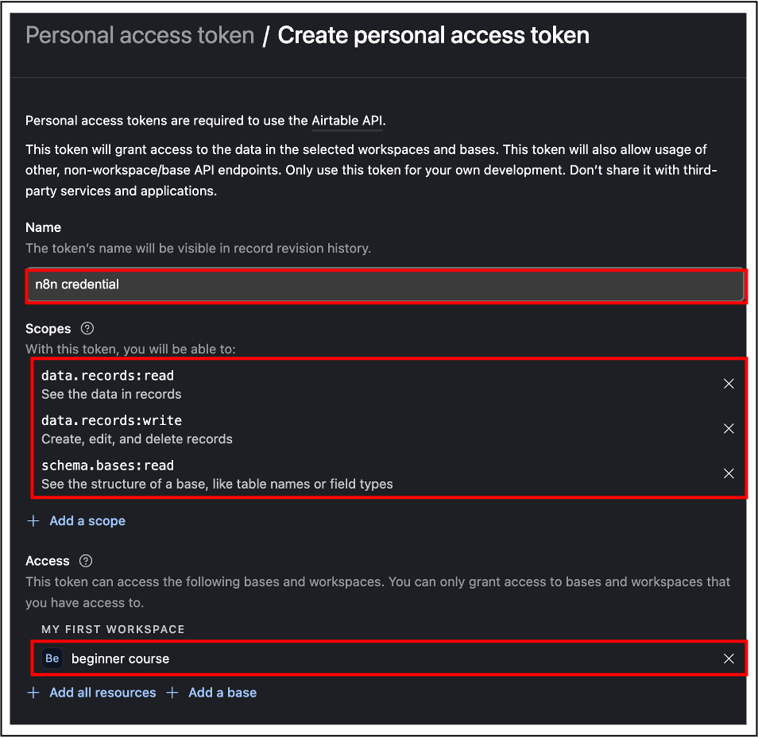
_Airtable의 Personal Access Token 생성_

### Airtable 노드 테스트

`Airtable` 노드 구성을 완료하면 `Execute step`을 선택하여 실행합니다. 처리하는 데 시간이 걸릴 수 있지만, `Airtable`에서 베이스를 확인하여 진행 상황을 확인할 수 있습니다.

결과는 다음과 같습니다.

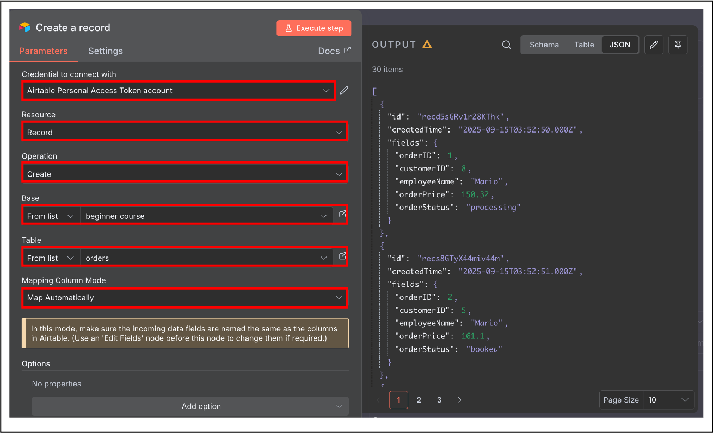
_Airtable 노드 설정 및 결과_

30개 데이터 레코드가 `Airtable`의 주문 테이블에 표시됩니다.

## 4. 주문 필터링
`조건 논리`를 사용하여 데이터를 필터링하는 방법과 `If` 노드를 사용하여 노드에서 표현식을 사용하는 방법을 알아봅니다.

이 단계를 마치면 작업 흐름은 다음과 같습니다.

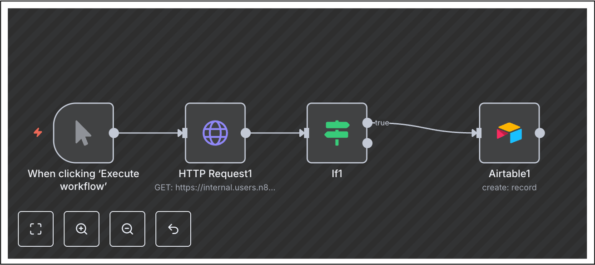
_필터링 추가한 워크플로_

`orderStatus`에서 `처리 중`인 주문만 `Airtable`에 삽입하려면 데이터를 필터링해야 합니다. 기본적으로, `orderStatus`가 처리 중이면 해당 상태의 모든 레코드를 `Airtable`에 삽입하고, `orderStatus`가 처리중이 아니면 모든 주문의 합계를 계산하도록 프로그램에 지시합니다.

이 `if-then-else` 명령은 조건 논리입니다. `n8n` 워크플로에서는 `If` 노드를 사용하여 조건 논리를 추가할 수 있으며, 이를 통해 비교 연산에 따라 워크플로를 조건부로 분할할 수 있습니다.

### Airtable 노드 앞에 If 노드 추가하기
먼저 `HTTP Request` 노드와 `Airtable` 노드 사이에 `If` 노드를 추가하겠습니다.

1. `HTTP Request` 노드와 `Airtable` 노드의 화살표 연결 위에 마우스를 올려놓습니다.
2. `HTTP Request` 노드와 `Airtable` 노드 사이의 `+` 기호를 클릭합니다.

### If 노드 구성하기
더하기(+)를 선택하면 신규 노드 추가로 인해 HTTP 요청에 대한 `Airtable` 노드 연결이 해제됩니다. 이제 `HTTP Request` 노드에 연결된 `If` 노드를 추가합니다.

1. `If` 노드를 검색하세요.
2. 검색 결과에 나타나면 노드를 선택합니다.

`If` 노드의 경우 표현식(expression)을 사용하겠습니다.
우선 `If` 노드 창에서 매개변수를 구성합니다.

- 다음 단계에 따라 `value1` 플레이스홀더에 `{{ $json.orderStatus }}`를 설정합니다.

    1. `value1` 필드 위에 마우스를 올려놓습니다.
    2. `value1` 필드 오른쪽에 있는 `Expression` 탭을 선택합니다.
    3. 다음으로, 링크 아이콘을 선택하여 표현식 편집기를 엽니다.

    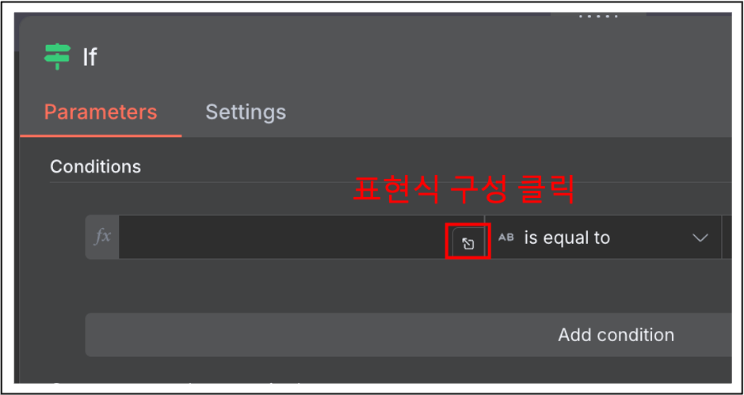
    _If 노드 표현식 클릭_

    - 왼쪽 패널을 사용하여 **HTTP Request > orderStatus**를 선택한 후 창 중앙의 **Expression** 필드로 끌어다 놓습니다.

    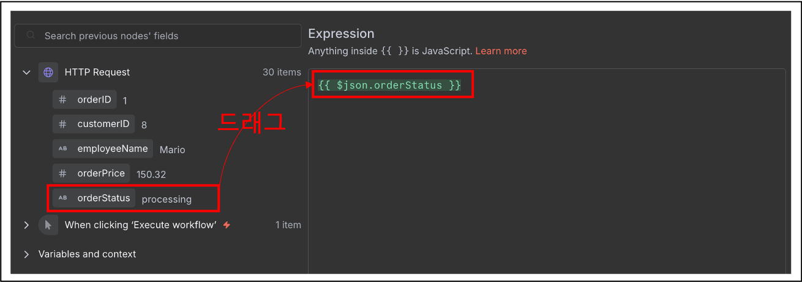
    _If 노드 표현식 설정_

    - 표현식을 추가한 후 `Edit Expression` 대화 상자를 닫습니다.

- **Operation** : **String > is equal to**를 선택합니다.
- `value2` 플레이스홀더를 `processing`으로 설정합니다.

이제 **Execute step** 버튼을 선택하여 `If` 노드를 테스트합니다.

결과는 다음과 같습니다.

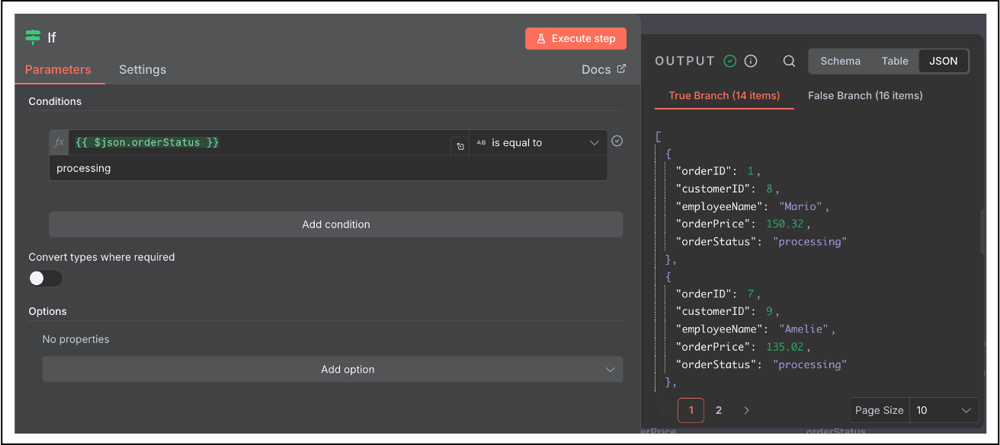
_If 노드 표현식 적용 결과_

주문 상태가 `processing`인 주문은 **True Branch** 출력에, 주문 상태가 `booked`인 주문은 **False Branch** 출력에 나타나야 합니다.

작업이 끝나면 `If` 노드의 창을 닫습니다.

### Airtable에 데이터 삽입
다음은 이 분류된 데이터를 `Airtable`에 입력하겠습니다. 
데이터 분석가의 요구 사항에는 '실제로는 테이블에 처리 주문만 삽입해야 합니다'라는 내용이 있습니다.

1. 분석가는 테이블에 있는 `processing` 주문만 필요하므로 `Airtable` 노드를 `If` 노드의 `true` 커넥터에 연결합니다.

2. 이미 `Airtable` 노드가 이미 캔버스에 있으므로 `If` 노드에서 `true` 커넥터를 선택하여 `Airtable` 노드로 드래그합니다.

3. 이제 `Airtable`에서 테이블을 열고 기존 행을 모두 삭제하고 `Airtable` 노드를 다시 테스트합니다.
그런 다음 `n8n`에서 `Airtable` 노드 창을 열고 `Execute step` 클릭하여 실행합니다.

4. `Airtable`에서 데이터를 확인하여 워크플로가 올바른 주문(`orderStatus`가 `processing`인 주문)만 추가했는지 확인합니다. 이제 30개가 아닌 `14개의 레코드`가 있어야 합니다.

이 단계에서는 작업 흐름이 다음과 같아야 합니다.

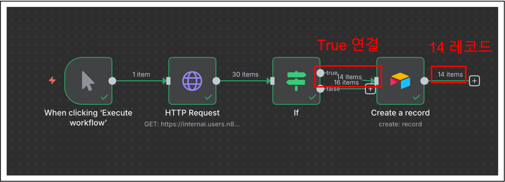
_If 노드의 True만 Airtable 입력_

## 5. 주문 처리를 위한 값 설정하기

이 워크플로 단계에서는 `Airtable`로 데이터를 전송하기 전에 `Edit Fields (Set) 노드(필드 편집)`를 사용하여 데이터를 선택하고 설정하는 방법을 살펴봅니다. 

이 단계를 마치면 워크플로는 다음과 같습니다.

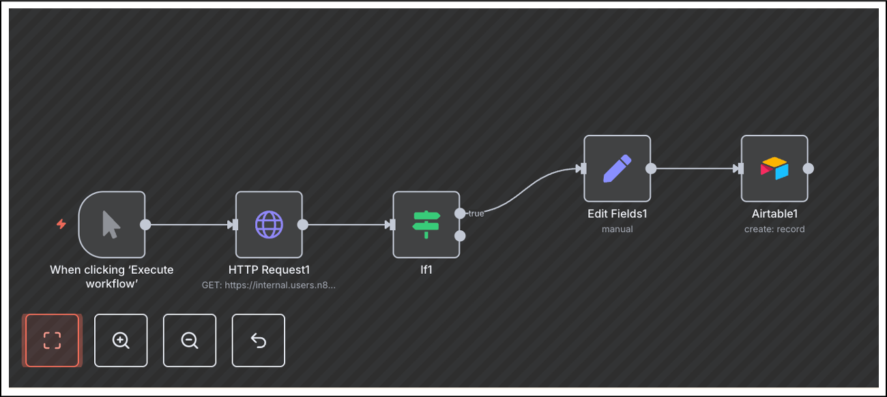
_필드 편집을 위한 Edit Fields 적용_

이 단계는 모든 주문의 `employeeName`과 `orderID` 데이터 만 `Airtable`에 삽입하도록 필터링하는 것입니다.

이를 위해서는 `Edit Fields (Set) 노드`를 사용해야 합니다. 이 노드를 사용하면 한 노드에서 다른 노드로 전송할 데이터를 선택하고 설정할 수 있습니다.

### Airtable 노드 앞에 다른 노드 추가하는 방법
워크플로에서 `If 노드`와 `Airtable 노드` 사이에 다른 노드를 추가합니다. `If 노드`의 `true` 커넥터에 대해 했던 것과 같은 방식입니다. 캔버스가 너무 복잡하다고 느껴지면 `Airtable 노드`를 더 멀리 드래그해도 됩니다.

### Edit Fields(필드 편집) 노드 구성하기
이제 `If 노드`의 `true` 커넥터에서 나오는 `+` 기호를 선택한 후 `Edit Fields (Set) 노드`를 검색합니다.

`Edit Fields 노드` 창을 열고 다음 매개변수를 구성합니다.

- **Mode**가 **Manual Mapping(수동 매핑)** 으로 설정되어 있는지 확인합니다.
- **Expression editor**를 사용할 수 있지만, **Input**에서 다음 두 개의 필드를 **Fields to Set**로 끌어다 놓겠습니다.
    - 첫 번째 필드로 **If > orderID**를 드래그합니다.
    - 두 번째 필드로 **If > employeeName**을 드래그합니다.

- **Include Other Input Fields(다른 입력 필드 포함)**가 `false`로 설정되어 있는지 확인합니다.

**Execute step**을 실행합니다. 

다음과 같은 결과가 표시됩니다.

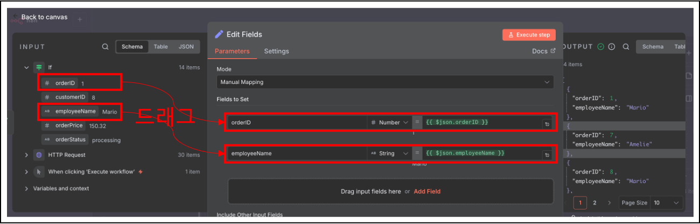
_Edit Fields 노드 구성하기_

### Airtable에 데이터 추가
이전에서 선택된 값을 `Airtable`에 삽입해 보겠습니다.

1. `Airtable` 베이스로 이동합니다.
2. `processingOrders`라는 이름의 새로운 테이블을 추가합니다.
3. 기존 열에서 두 개의 열로만 변경합니다.
    - `orderID`(primary field): Number
    - `employeeName`: Single line text
4. 새 테이블에서 비어있는 세 개 행을 삭제합니다.
5. `n8n`에서 `Edit Fields 노드`를 **Airtable 노드**에 연결합니다.
6. `Airtable 노드` 구성을 업데이트하여 `orders` 테이블 대신 새 테이블 `processingOrders` 가리키도록 합니다.
7. `Airtable 노드`를 테스트하여 새 테이블 `processingOrders`에 레코드가 삽입되는지 확인합니다. 

실행 시 다음과 같은 결과가 나옵니다.

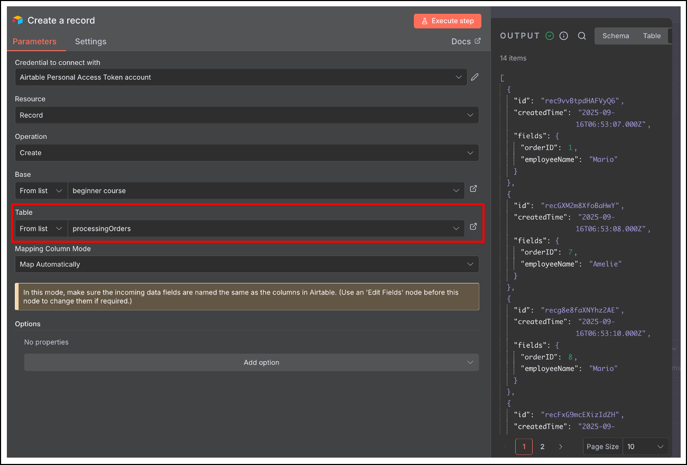
_두 개의 필드만 새 테이블 추가_

## 6. 예약된 주문 계산하기

`n8n`이 데이터를 구조화하는 방법과 `Code 노드`를 사용하여 계산을 수행하는 `사용자 지정 JavaScript 코드`를 추가하는 방법을 알아보겠습니다. 

이 단계를 마치면 워크플로는 다음과 같습니다.

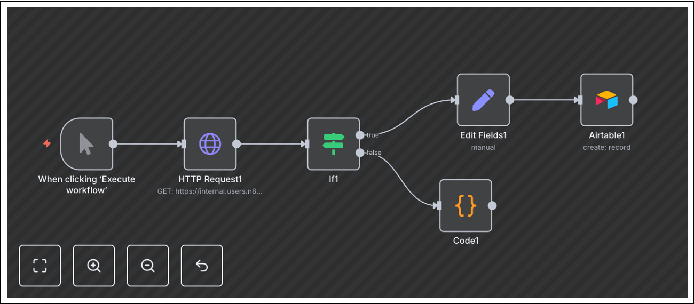
_사용자 정의 JavaScript 추가를 위한 Code 노드 구성_

다음 단계는 예약된 주문에서 두 가지 값을 계산합니다.

- 예약된 주문의 총 수
- 예약된 모든 주문의 총 가치

데이터를 계산하고 워크플로에 더 많은 기능을 추가하려면 `사용자 정의 JavaScript 코드`를 작성할 수 있는 `Code 노드`를 사용할 수 있습니다.

`n8n`에서 노드 간에 전달되는 데이터는 다음과 같은 JSON 구조를 가진 객체 배열입니다.

```javascript
[
    {
   	 "json": { 
   		 "apple": "beets",
   		 "carrot": {
   			 "dill": 1
   		 }
   	 },
   	 "binary": { 
   		 "apple-picture": { 
   			 "data": "....", 
   			 "mimeType": "image/png", 
   			 "fileExtension": "png", 
   			 "fileName": "example.png", 
   		 }
   	 }
    },
    ...
]
```
예상되는 형식에 대한 자세한 내용은 `n8n` 데이터 구조 페이지에서 확인할 수 있습니다.

### Code 노드 구성
워크플로에서 `If 노드`의 `false` 분기에 `Code 노드`를 추가합니다.

`Code 노드` 창을 열고 다음과 같이 매개변수를 구성합니다.

- **Mode** : **Run Once for All Items(모든 항목에 대해 한 번 실행)를** 선택합니다.
- **Language** : **JavaScript**를 선택합니다.
- 아래 코드를 복사하여 `Code` 상자에 붙여넣어 기존 코드를 대체합니다.
    ```javascript
    let items = $input.all();
    let totalBooked = items.length;
    let bookedSum = 0;

    for (let i=0; i < items.length; i++) {
    bookedSum = bookedSum + items[i].json.orderPrice;
    }

    return [{ json: {totalBooked, bookedSum} }];
    ```

계산 결과를 반환하는 형식은 다음과 같습니다..
```javascript
return [{ json: {totalBooked, bookedSum} }]
```
이제 **Execute step**을 클릭하면 다음과 같은 결과가 표시됩니다.

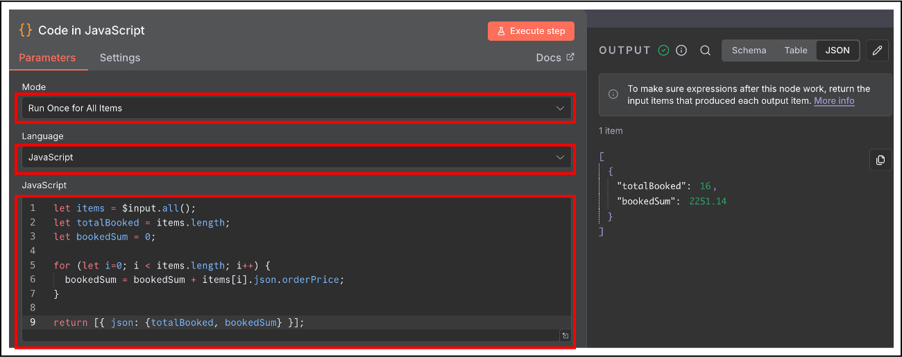
_Code 노드 실행 결과_

## 7. 팀에 Discord로 알림하기

이제 예약된 주문의 계산된 요약을 [Discord 노드](https://docs.n8n.io/integrations/builtin/app-nodes/n8n-nodes-base.discord/)를 사용해서 `Discord 채널`을 통해 알립니다.
이 단계를 마치면 워크플로는 다음과 같습니다.

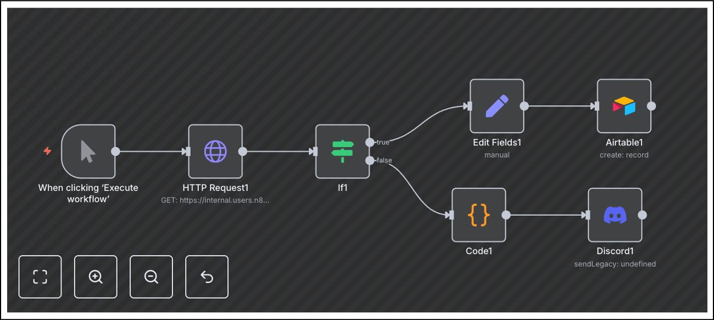
_Disocrd로 팀에 알림을 위한 구성_

이 워크플로에서는 [Discord의 n8n server](https://discord.com/invite/G98WXzsjky)로 메시지를 전송합니다.

아래 단계를 시작하기 전에 위 링크를 사용하여 `Discord의 n8n server`에 접속하고, `#course-level-1`채널에 접속할 수 있는지 확인합니다.

워크플로에서 `Code 노드`에 연결된 `Discord 노드`를 추가합니다.

`Discord 노드`를 검색할 때 **Message Actions(메시지 작업)**을 찾아 **Send a message(메시지 보내기)**를 선택하여 노드를 추가합니다.

`Discord 노드` 창에서 다음 매개변수를 구성합니다.

- **Connection Type(연결 유형)** : `Webhook`을 선택합니다.
- **Credential for Discord Webhook(Discord Webhook에 대한 자격 증명)** : **Create New Credential(새 자격 증명 만들기)**를 선택합니다.
    - [등록](https://n8n-community.typeform.com/to/PDEMrevI?typeform-source=docs.n8n.io)할 때 받은 이메일에서 **Webhook URL**을 복사하여 자격 증명의 **Webhook URL** 필드에 붙여넣으세요.
    - **Save**을 선택한 후 자격 증명 대화 상자를 닫습니다.
- Operation(작업) : **Send a Message**를 선택합니다.
- Message :
    - 메시지 필드의 오른쪽에 있는 **Expression** 탭을 선택합니다.
    - 아래 텍스트를 복사하여 **Expression** 창에 붙여 넣거나 **Expression Editor**를 사용하여 직접 구성할 수 있습니다.

    ```
    This week we've {{$json["totalBooked"]}} booked orders with a total value of {{$json["bookedSum"]}}. My Unique ID: {{ $('HTTP Request').params["headerParameters"]["parameters"][0]["value"] }}
    ```

이제 `Discord 노드`에서 **Execute step**을 클릭하여 실행합니다. 

모든 것이 제대로 작동하면 `n8n`에서 다음과 같은 출력이 표시됩니다

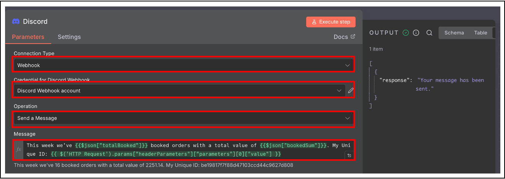
_Discord 노드 구성과 결과_

그리고 메시지는 `Discord` 채널 `#course-level-1`에 나타나야 합니다.

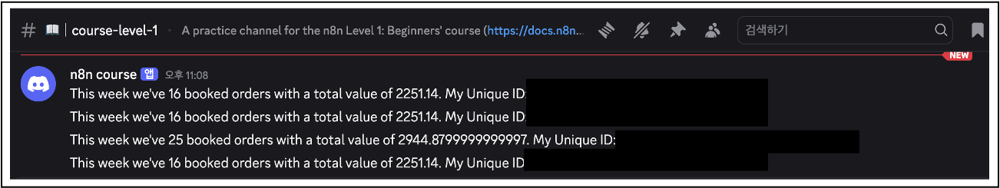
_Discord 채널 메시지 전송_

## 8. 워크플로 스케줄링

이 워크플로 단계에서는 `Schedule Trigger 노드`를 사용하여 설정된 시간/간격에 자동으로 실행되도록 워크플로를 예약하는 방법을 알아봅니다. 

이 단계를 완료하면 워크플로는 다음과 같습니다.

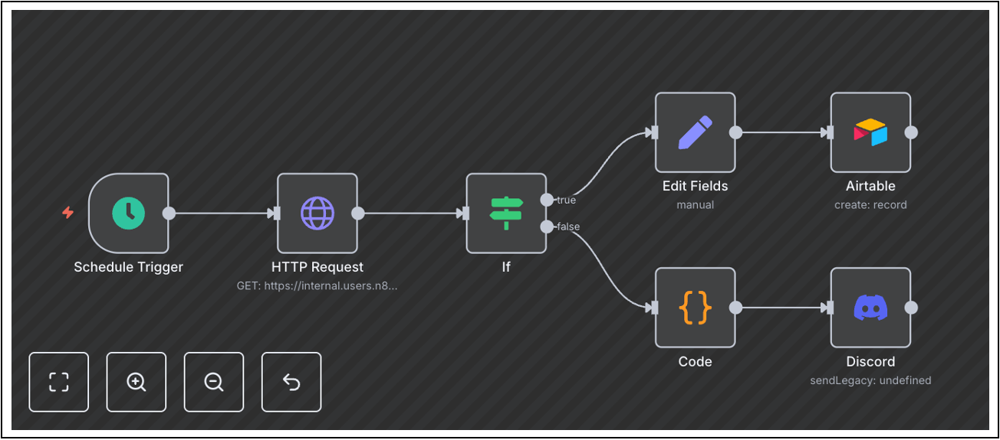
_Scheduel Trigger 노드 설정

지금까지 만든 워크플로는 `Execute Workflow`을 클릭할 때만 실행됩니다. 그러나 분석가는 매주 월요일 아침마다 자동으로 실행되기를 원합니다. [Schedule Trigger](https://docs.n8n.io/integrations/builtin/core-nodes/n8n-nodes-base.scheduletrigger/)를 사용하면 워크플로가 정해진 날짜, 시간 또는 간격으로 주기적으로 실행되도록 예약할 수 있습니다.

이를 구현하기 위해 처음에 사용했던 `Manual Trigger 노드`를 제거하고 대신 `Schedule Trigger 노드`로 교체합니다.

### Manual Trigger 노드 제거
먼저, `Manual Trigger 노드`를 제거합니다.

1. `HTTP Request` 노드에 연결된 `Manual Trigger 노드`를 선택합니다.
2. 삭제하려면 휴지통 아이콘을 선택하세요.

### Schedule Trigger 노드 추가
1. 노드 패널을 열고 `Schedule Trigger`를 검색합니다.
2. 검색 결과에 나타나면 선택합니다.

`Schedule Trigger 노드` 창에서 다음 매개변수를 구성합니다.
- **Trigger Interval(트리거 간격)** : `Weeks`를 선택합니다.
- **Weeks Between Triggers(트리거 간 주)** : `1` 입력합니다.
- **Trigger on weekdays(주중에 트리거)** : `Monday`를 선택합니다 (기본값 `Sunday`를 제거합니다).
- **Trigger at Hour(매시 트리거)** : `9 am`를 선택합니다.
- **Trigger at Minute(분에 트리거)** : `0`을 입력합니다.

`Schedule Trigger 노드`는 다음과 같아야 합니다.

### Schedule Trigger 노드 연결하기
캔버스로 돌아가서 `Schedule Trigger 노드`의 화살표를 `HTTP Request 노드`에 연결합니다.

설정은 다음과 같습니다.

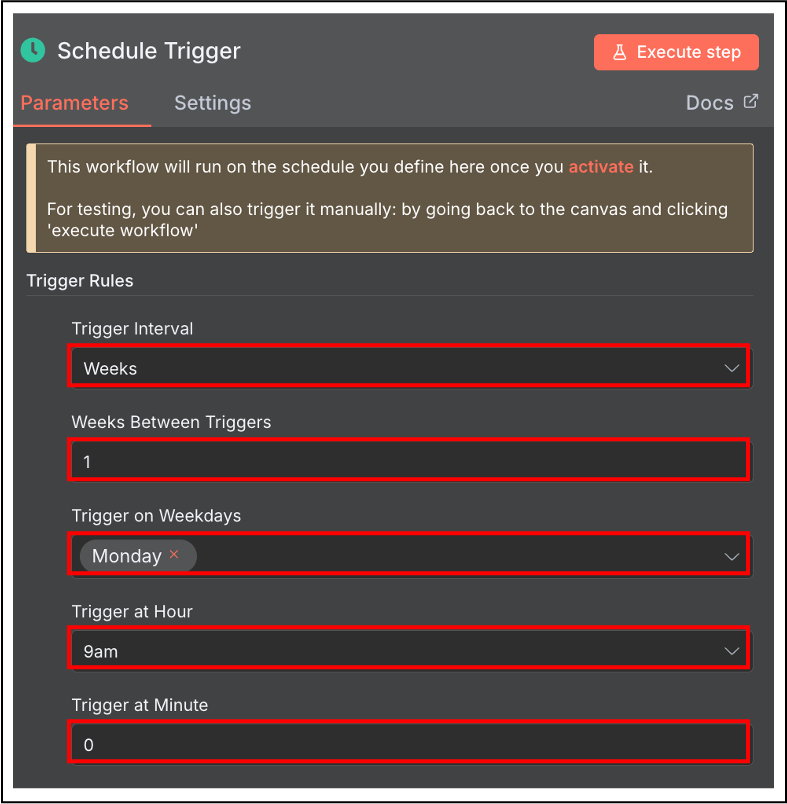
_Schedule Trigger 구성하기_

## 9. 워크플로 활성화 및 검토

이 단계에서는 워크플로를 활성화하고 기본 워크플로 설정을 변경하는 방법을 알아봅니다.

워크플로를 활성화하면 트리거 노드가 입력을 받거나 조건을 충족할 때마다 자동으로 실행됩니다. 기본적으로 새로 생성된 모든 워크플로는 비활성화된 상태로 시작됩니다.

워크플로를 활성화하려면 편집기 UI 상단 탐색 메뉴에서 '비활성 ' 토글을 '활성화' 로 설정하세요 . 이제 네이선의 워크플로가 매주 월요일 오전 9시에 자동으로 실행됩니다.

### 워크플로 실행
실행은 첫 번째 노드부터 마지막 ​​노드까지 워크플로 실행이 완료된 것을 나타냅니다. n8n은 워크플로 실행을 기록하여 워크플로의 성공 여부를 확인할 수 있도록 합니다. 실행 로그는 워크플로를 디버깅하고 어떤 단계에서 문제가 발생하는지 확인하는 데 유용합니다.

특정 워크플로의 실행 내역을 보려면 캔버스에 워크플로가 열려 있을 때 '실행' 탭 으로 전환하세요 . 노드 편집기로 돌아가려면 '편집기' 탭을 사용하세요.

n8n 인스턴스 전체의 실행 로그를 보려면 편집기 UI에서 개요를 선택한 다음 기본 패널에서 실행 탭을 선택합니다.

실행 창 에는 다음 정보가 포함된 표가 표시됩니다.

이름 : 워크플로의 이름
시작 시간 : 워크플로가 시작된 날짜 및 시간
상태 : 워크플로의 상태(대기, 실행 중, 성공, 취소 또는 실패) 및 워크플로를 실행하는 데 걸린 시간
실행 ID : 이 워크플로 실행의 ID

워크플로 설정#
워크플로 설정 에서 워크플로와 실행을 사용자 정의하거나 일부 글로벌 기본 설정을 덮어쓸 수 있습니다  .

캔버스에서 워크플로가 열려 있을 때 편집기 UI의 오른쪽 상단 모서리에 있는 세 개의 점을 선택한 다음 설정을 선택하여 이러한 설정에 액세스합니다.

워크플로 설정 창 에서 다음 설정을 구성할 수 있습니다.

**실행 순서v1** : 다중 분기 워크플로의 실행 논리를 선택합니다. 기존 실행 순서를 사용하는 워크플로가 없는 경우 이 설정을 그대로 두세요 .
**오류 워크플로 **: 현재 워크플로 실행에 실패할 경우 실행할 워크플로입니다.
이 워크플로는 다음을 통해 호출할 수 있습니다 . 실행 하위 워크플로 노드를 사용하여 이 워크플로를 호출할 수 있는 워크플로 .
시간대 : 현재 워크플로에 사용할 시간대입니다. 설정하지 않으면 글로벌 시간대가 적용됩니다. 특히, 워크플로가 적절한 시간에 실행되도록 해야 하므로 일정 트리거 노드 의 경우 이 설정이 중요합니다.
실패한 프로덕션 실행 저장 : n8n이 워크플로 실패 시 해당 실행 데이터를 저장해야 하는지 여부입니다. 기본값은 저장입니다.
성공적인 프로덕션 실행 저장 : n8n이 워크플로가 성공할 때 실행 데이터를 저장해야 하는지 여부입니다. 기본값은 저장입니다.
수동 실행 저장 : n8n이 편집기 UI에서 시작된 실행을 저장할지 여부를 설정합니다. 기본값은 '저장'입니다.
실행 진행률 저장 : n8n이 각 노드의 실행 데이터를 저장할지 여부를 설정합니다. '저장'으로 설정하면 오류 발생 시 중단된 지점부터 워크플로를 재개할 수 있지만, 실행 속도가 느려질 수 있습니다. 기본값은 저장하지 않는 것입니다.
시간 초과 워크플로 : 특정 시간 후 워크플로 실행을 취소할지 여부입니다. 기본값은 시간 초과되지 않음입니다.

## 정리


## References
- [n8n 공식 문서](https://docs.n8n.io/){: target="_blank"}
- [n8n Self hosted AI Starter Kit](https://github.com/n8n-io/self-hosted-ai-starter-kit){: target="_blank"}