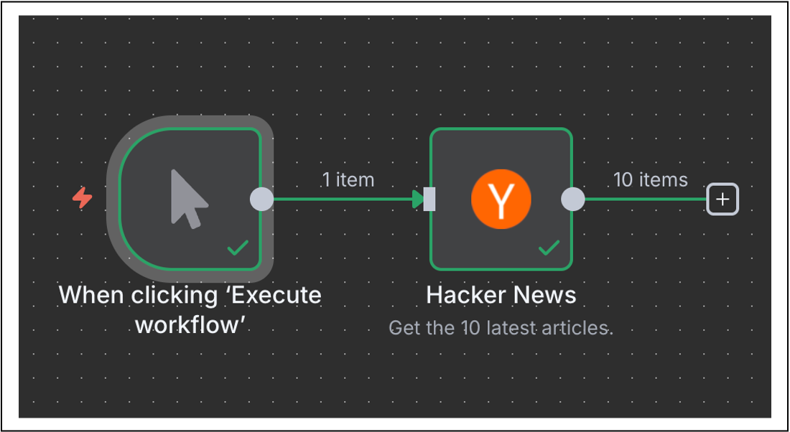

## 간단한 워크플로우 구축 살펴보기
실습에서는 `Hacker News`에서 자동화 관련 기사 10개를 가져오는 간단한 워크플로를 구축해 보겠습니다. 
이 과정은 다음 5단계로 구성됩니다.

> 해커 뉴스(Hacker News, HN)는 컴퓨터 과학과 기업가 정신에 초점을 맞춘 소셜 뉴스 웹사이트입니다.

1. `Manual Trigger` 노드 추가
2. `Hacker News` 노드 추가
3. `Hacker News` 노드 구성
4. 노드를 실행
5. 워크플로 저장

## Manual Trigger 노드 추가
1. 노드 패널을 엽니다. (아래 두 가지로 열 수 있습니다.)
    - `캔버스 오른쪽 상단 모서리`에 있는 `+` 아이콘을 선택합니다.
    - 키보드의 `Tab`키를 클릭합니다.
2. 노드 패널에서 `Manual Trigger` 입력하여 노드를 검색합니다.
3. 검색 결과에 나타나면 선택합니다.

이렇게 하면 캔버스에 `Manual Trigger` 노드가 추가되어 `수동으로 워크플로 실행 버튼`을 선택하여 워크플로를 실행할 수 있습니다.

완성된 `워크플로`는 다음과 같습니다.

_워크플로 완성 화면_

## Hacker News 노드 추가
1. `Manual Trigger` 노드 오른쪽에 있는 `+` 아이콘을 선택하여 노드 패널을 엽니다.
2. 노드 패널에서 `Hacker News` 노드를 검색합니다.
3. 검색 결과에 나타나면 선택합니다.
4. 작업 섹션 에서 여러 항목 가져오기를 선택합니다.

`n8n`은 캔버스에 노드를 추가하고 노드 창이 열려 구성 세부 정보를 표시합니다.

## Hacker News 노드 구성
1. 편집기 UI에 새 노드를 추가하면 노드가 자동으로 활성화됩니다. 노드 세부 정보는 여러 옵션이 있는 창에서 열립니다.

매개변수 : 매개변수를 조정하여 노드의 기능을 세부적으로 조정하고 제어합니다.
설정 : 노드의 디자인과 실행을 제어하기 위해 설정을 조정합니다.
문서 : 이 노드에 대한 n8n 문서를 새 창에서 엽니다.

### 매개변수
Hacker News 노드가 작동하려면 몇 가지 매개변수를 구성해야 합니다.

리소스 : 전체
이 리소스는 모든 데이터 레코드(기사)를 선택합니다.
작업 : 여러 개 가져오기
이 작업은 선택한 모든 기사를 가져옵니다.
제한 : 10
이 매개변수는 Get Many 작업이 반환하는 결과 수에 제한을 설정합니다.
추가 필드 > 필드 추가 > 키워드 : 자동화
추가 필드는 특정 노드에 추가하여 요청을 더욱 구체적으로 만들거나 결과를 필터링할 수 있는 옵션입니다. 이 예시에서는 "자동화"라는 키워드가 포함된 기사만 가져오고 싶습니다.
Hacker News 노드의 매개변수 구성은 이제 다음과 같습니다.

### 설정
설정 섹션 에는 노드 디자인 및 실행을 위한 여러 옵션이 포함되어 있습니다. 이 경우에는 편집기 UI 캔버스에서 노드의 모양을 설정하는 마지막 두 가지 설정만 구성하겠습니다.

Hacker News 노드 설정에서 다음을 편집합니다.

참고사항 : 최신 기사 10개를 받아보세요.

흐름에 메모를 표시할까요? : true로 전환
이 옵션을 선택하면 캔버스의 노드 아래에 메모가 표시됩니다.

이제 Hacker News 노드의 설정 구성은 다음과 같습니다.

## 노드 실행
노드 세부 정보 창에서 '단계 실행' 버튼을 선택하세요 . 출력 테이블 보기 에 10개의 결과가 표시됩니다 .

노드 실행
노드가 성공적으로 실행되면 캔버스의 노드 위에 작은 녹색 확인 표시가 나타납니다.

매개변수에 문제가 없고 모든 것이 정상적으로 작동하면 요청된 데이터가 노드 창에 테이블 , JSON , 스키마 형식으로 표시됩니다. 노드 창 상단의 테이블 | JSON | 스키마 버튼 에서 원하는 뷰를 선택하여 뷰를 전환할 수 있습니다 .

JSON 뷰로 표현한 Hacker News 출력은 다음과 같습니다.

노드 창에는 노드 실행에 대한 자세한 정보가 표시됩니다.

출력 제목 옆에 작은 아이콘이 있습니다(노드 실행이 성공하면 녹색 체크 표시가 나타납니다). 그 옆에는 정보 아이콘이 있습니다. 이 아이콘에 마우스를 올리면 워크플로우 내 각 노드의 성능에 대한 통찰력을 제공하는 두 가지 정보가 더 표시됩니다.
시작 시간 : 노드 실행이 시작된 시간.
실행 시간 : 노드가 실행을 시작한 순간부터 결과를 반환하는 데 걸린 시간입니다.
출력 제목 바로 아래에 또 다른 정보인 10개 항목이 있습니다 . 이 필드는 노드 요청에서 반환된 항목(레코드) 수를 표시합니다. 이 예에서는 2단계에서 설정한 제한 값인 10개로 예상됩니다. 하지만 제한 값을 설정하지 않은 경우, 실제로 반환되는 레코드 수를 확인하는 것이 유용합니다.

## 워크플로 저장
노드 편집을 마치면 캔버스로 돌아가기를 선택하여 메인 캔버스로 돌아갑니다.

기본적으로 워크플로는 자동으로 "내 워크플로"로 저장됩니다.

이번 수업에서는 워크플로 이름을 "해커 뉴스 워크플로"로 바꾸세요.

워크플로 이름을 변경한 후에는 반드시 저장하세요.

워크플로를 저장하는 방법에는 두 가지가 있습니다.

편집기 UI의 캔버스에서 키보드의 Ctrl + S 또는 Cmd + S를 클릭합니다.
편집기 UI 오른쪽 상단에 있는 ' 저장 ' 버튼을 선택하세요 . 대화 상자 바깥쪽을 클릭하여 노드 편집기를 먼저 종료해야 할 수도 있습니다.
저장 버튼 대신 회색의 저장됨 텍스트가 표시되면 워크플로가 자동으로 저장된 것입니다.