> 학습할 리소스는 [Anthropic Academy](https://www.anthropic.com/learn){: target="_blank"}를 사용합니다.
{: .prompt-info }

## 2. 1   Claude Code 설정하기

먼저 `Claude Code`를 로컬에 설치합니다.

전체 설정 지침은 [여기](https://docs.anthropic.com/en/docs/claude-code/setup){: target="_blank"}에서 확인할 수 있습니다:

다음을 수행합니다:

1. `NodeJS`가 설치되어 있는지 확인합니다.

   이미 설치되어 있는지 확실하지 않으면 설치 프로그램을 [다운로드](https://nodejs.org/en/download){: target="_blank"}할 수 있습니다.
2. 터미널에서 실행합니다.
    ```bash
    npm install -g @anthropic-ai/claude-code
    ```
3. 설치 후 `claude` 명령어를 터미널에서 실행합니다.
4. 이 명령을 처음 실행하면 인증을 요청하는 메시지가 표시됩니다.

> AWS Bedrock이나 Google Cloud Vertex를 사용하는 경우 추가 설정이 필요합니다.
>
> AWS Bedrock에 대한 [안내](https://docs.anthropic.com/en/docs/claude-code/amazon-bedrock){: target="_blank"}, 
> Google Cloud Vertex에 대한 [안내](https://docs.anthropic.com/en/docs/claude-code/){: target="_blank"}
{: .prompt-info }

## 2. 2 샘플 프로젝트 설정하기

`리액트 컴포넌트 자동 생성기 프로젝트`를 위해 하기 설정을 합니다.

1. [uigen.zip](https://cc.sj-cdn.net/instructor/4hdejjwplbrm-anthropic/assets/1750970894/uigen.zip?response-content-disposition=attachment&Expires=1755329806&Signature=GV1vldsm3Eq84hbd58NtazGj7E-L9rH1f1ukgW~U~8Pby1SW-Iu-YZMFSNmjZENGGeYeOZyN4407Gr5WlYBYMmma8WLAuIFQgkQdcJALgTXjBaj~1tnfoB2Pu8q926eYrf72tbOTzDrt6DHYR5qhtKTeCfnz-3k8FQ45i45jO-fnkyYwOYVcptY2g4LQhaPDK~1PT9n-Y3LxXP-Prm93T4GEZF~uzdqlriM1a98Ux1G3Y~w7x09AwRTqe2ag-WBmWxpdkh6Lz0Mf7716yyap9OuMlwRw1KIIOrwGxAGx9SUGD1m25bW4FCQsTG7arz-WVuxsDNvxHKsfbTiEdo2vtg__&Key-Pair-Id=APKAI3B7HFD2VYJQK4MQ){: target="_blank"} 파일 다운로드 후 압축을 풉니다.
2. 프로젝트 디렉터리에서 `npm run setup` 종속성을 설치하고 로컬 SQLite 데이터베이스를 설정합니다.
3. `선택 사항`:
   이 프로젝트에서는 Anthropic API를 통해 Claude를 사용하여 UI 구성 요소를 생성합니다.
   앱을 완전히 테스트하려면 Anthropic API에 액세스할 수 있는 API 키를 제공해야 합니다.
   API 키를 제공하지 않으면 앱에서 정적 페이크 코드를 생성합니다.
   API 키를 설정하는 방법은 다음과 같습니다:

    - [`https://console.anthropic.com/`](https://console.anthropic.com/){: target="_blank"}에서 Anthropic API 키를 받으세요.
    - API 키를 `.env` 파일에 입력합니다.

4. `npm run dev` 실행하여 프로젝트를 시작합니다.

5. 마지막으로 `Claude Code`를 실행합니다.
  ```bash
  claude
  ```

## 2. 3 컨텍스트 추가

Claude와 함께 코딩 프로젝트를 작업할 때 컨텍스트 관리가 매우 중요합니다.
프로젝트에는 수십 개 또는 수백 개의 파일이 있을 수 있지만, Claude는 효과적으로 도움을 주기 위해 올바른 정보만 필요합니다.
너무 많은 관련 없는 컨텍스트는 실제로 Claude의 성능을 저하하므로, 관련 파일과 문서로 Claude를 안내하는 방법을 배우는 것이 필수적입니다.

### 2. 3. 1 `/init` 명령어

새 프로젝트에서 Claude를 처음 시작할 때 `/init` 명령어를 실행합니다.
Claude에게 전체 코드베이스를 분석하고 다음을 이해하도록 지시합니다:

- 프로젝트의 목적과 아키텍처
- 중요한 명령어와 핵심 파일들
- 코딩 패턴과 구조


_/init 명령어_

코드를 분석한 후, Claude는 요약을 작성하고 이를 `CLAUDE.md` 파일에 저장합니다.
Claude가 이 파일을 생성할 권한을 요청할 때, `Enter`를 눌러 각 쓰기 작업을 승인하거나, `Shift+Tab`을 눌러 세션 전체에서 Claude가 자유롭게 파일을 작성하도록 할 수 있습니다.

### 2. 3. 2 CLAUDE.md 파일 생성

`CLAUDE.md` 파일은 두 가지 주요 목적을 제공합니다:

- 중요한 명령어, 아키텍처, 코딩 스타일을 지적하며 Claude를 코드베이스를 통해 안내합니다
- Claude에게 특정하거나 사용자 정의 지시 사항을 제공할 수 있게 합니다

이 파일은 Claude에게 하는 모든 요청에 포함되므로, 프로젝트를 위한 지속적인 시스템 프롬프트를 갖는 것과 같습니다.

### 2. 3. 3 세 가지 위치의 CLAUDE.md 파일

Claude는 세 가지 일반적인 위치에서 세 가지 다른 `CLAUDE.md` 파일을 인식합니다:


_CLAUDE.md 파일_

- `CLAUDE.md` : `/init`으로 생성되며, 소스 제어에 커밋되고 다른 엔지니어들과 공유됩니다.
- `CLAUDE.local.md` : 다른 엔지니어들과 공유되지 않으며, Claude를 위한 개인적인 지시 사항과 사용자 정의를 포함합니다.
- `~/.claude/CLAUDE.md` : 머신의 모든 프로젝트에서 사용되며, 모든 프로젝트에서 Claude가 따르기를 원하는 지시 사항을 포함합니다.

### 2. 3. 4 사용자 정의 지시 사항 추가하기

`CLAUDE.md` 파일에 지시 사항을 추가하여 Claude의 동작을 사용자 정의할 수 있습니다.
예를 들어, Claude가 코드에 너무 많은 주석을 추가하고 있다면, 파일을 업데이트하여 이를 해결할 수 있습니다.

`#` 명령어를 사용하여 "메모리 모드"로 진입합니다. 이를 통해 `CLAUDE.md` 파일을 스마트하게 편집할 수 있습니다.

다음과 같이 입력하면 됩니다:

```
# 주석을 조금만 사용하세요. 복잡한 코드에만 주석을 달아주세요.
```

Claude가 이 지시 사항을 자동으로 `CLAUDE.md` 파일에 병합합니다.


_코드 스타일 추가 정의_

### 2. 3. 5 `'@'`를 사용한 파일 언급

Claude가 특정 파일을 살펴보도록 하려면, `@` 기호 뒤에 파일 경로를 사용하세요.
이렇게 하면 해당 파일의 내용이 Claude에 대한 요청에 자동으로 포함됩니다.

예를 들어, 인증 시스템에 대해 질문하고 관련 파일을 알고 있다면, 다음과 같이 입력할 수 있습니다:

```
인증 시스템은 어떻게 작동하나요? @auth
```

Claude가 auth 관련 파일 목록을 보여주고, 선택한 파일을 대화에 포함합니다.


_인증 파일 언급_

### 2. 3. 6 `CLAUDE.md`에서 파일 참조

같은 `@` 구문을 사용하여 `CLAUDE.md` 파일에서 직접 파일을 언급할 수도 있습니다.
이는 프로젝트의 여러 측면과 관련된 파일에 특히 유용합니다.
예를 들어, 데이터 구조를 정의하는 데이터베이스 스키마 파일이 있다면,`CLAUDE.md`에 다음을 추가할 수 있습니다:

```
데이터베이스 스키마는 @prisma/schema.prisma 파일에 정의되어 있습니다.
```

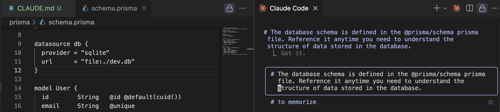
_직접 파일 언급_

이런 방식으로 파일을 언급하면, 그 내용이 모든 요청에 자동으로 포함되므로 Claude가 매번 스키마 파일을 검색하고 읽을 필요 없이 데이터 구조에 대한 질문에 즉시 답변할 수 있습니다.


_데이터 구조 즉시 답변_

## 2. 4 변경 사항 만들기

### 2. 4. 1 정확한 소통을 위한 스크린숏 사용하기

Claude와 소통하는 가장 효과적인 방법의 하나는 스크린숏을 사용하는 것입니다.
인터페이스의 특정 부분을 수정하고 싶을 때, 스크린숏을 찍으면 Claude가 정확히 무엇을 언급하고 있는지 이해하는 데 도움이 됩니다.

Claude에 스크린숏을 붙여 넣으려면 `Ctrl+V`를 사용합니다(macOS에서는 `Cmd+V`). 
이 키보드 단축키는 채팅 인터페이스에 스크린숏을 붙여넣기 위해 특별히 설계되었습니다. 
이미지를 붙여 넣은 후, Claude에게 애플리케이션의 해당 영역에 특정 변경사항을 요청할 수 있습니다.

#### 예: 스크린숏 붙여 넣고 위치 수정

실행한 샘플 프로젝트에서 좌측 상단에 있던 대화창에 스크린숏을 붙여 넣고 세로 중간 위치로 변경 요청했습니다.

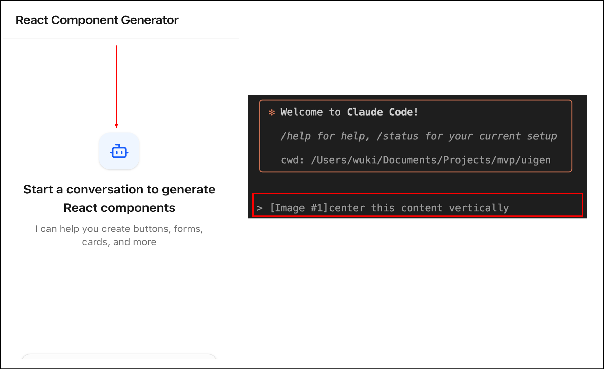
_예: 스크린 샷 기반 위치 수정_

### 2. 4. 2 계획 모드 (Planning Mode)

코드베이스 전반에 걸친 광범위한 연구가 필요한 더 복잡한 작업의 경우, 계획 모드를 활성화할 수 있습니다.
이 기능은 Claude가 변경 사항을 구현하기 전에 프로젝트를 면밀히 탐색하도록 합니다.
`Shift + Tab`을 두 번 (이미 편집을 자동 승인하고 있다면 한 번) 눌러 계획 모드를 활성화합니다.

이 모드에서 Claude는:

- 더 많은 프로젝트의 파일을 읽습니다.
- 상세 구현 계획을 작성합니다.
- 정확히 무엇을 하는지 의도를 보여줍니다.
- 진행하기 전에 승인을 기다립니다.

이를 통해 계획을 검토하고, Claude가 중요한 것을 놓쳤거나 특정 시나리오를 고려하지 않았다면 방향을 재조정할 기회를 얻을 수 있습니다.

#### 예: 계획 모드에서 시스템 용어를 친근한 문장 표현으로 수정 요청

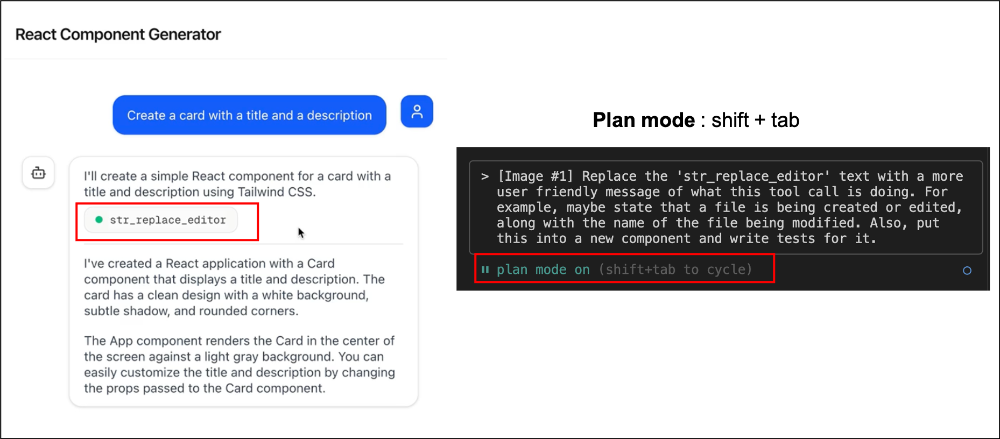
_계획 모드_

### 2. 4. 3 사고 모드 (Thinking Mode)

Claude는 `사고 모드`를 통해 다양한 수준의 추론을 제공합니다.
이를 통해 Claude가 설루션을 제공하기 전에 복잡한 문제에 대해 더 많은 시간을 들여 추론할 수 있습니다.

사용할 수 있는 `사고 모드`는 다음과 같습니다:

- `"Think"` : 기본 추론
- `"Think more"` : 확장 추론
- `"Think a lot"` : 포괄적 추론
- `"Think longer"` : 연장된 시간 추론
- `"Ultrathink"` : 최대 추론 능력

각 모드는 Claude에게 점진적으로 더 많은 토큰을 제공하여, 도전적 문제에 대한 더 깊은 분석을 가능하게 합니다.

#### 예: 사고 모드 활성화하기

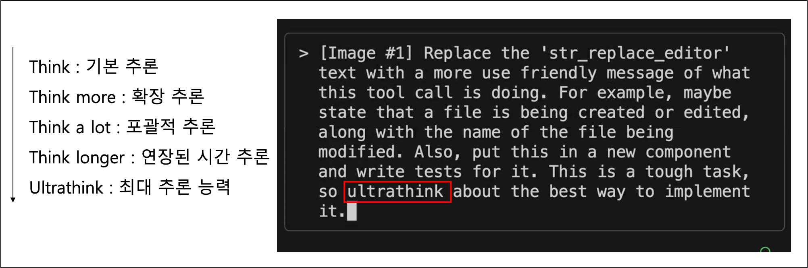
_사고 모드_

### 2. 4. 4 계획 모드 vs 사고 모드 사용 시기

다음과 같이 두 기능은 서로 다른 유형의 복잡성을 처리합니다:

`계획 모드`가 최적인 경우:

- 코드베이스에 대한 광범위한 이해가 필요한 작업
- 다단계 구현
- 여러 파일이나 컴포넌트에 영향을 주는 변경 사항

`사고 모드`가 최적인 경우:

- 복잡한 논리 문제
- 어려운 이슈 디버깅
- 알고리즘 도전 과제

폭과 깊이가 모두 필요한 작업의 경우 두 모드를 결합할 수 있습니다.
다만 두 기능 모두 `추가 토큰을 소비`하므로, 사용 시 `비용을 고려`해야 합니다.


## 2. 5 컨텍스트 제어

Claude와 복잡한 작업을 수행할 때, 대화를 집중적이고 생산적으로 유지하기 위해 대화를 안내해야 하는 경우가 있습니다. 
대화의 흐름을 제어하고 Claude가 정상적인 궤도를 유지하도록 도울 수 있는 여러 기법이 있습니다.

### 2. 5. 1 Escape로 Claude 중단하기
때때로 Claude가 잘못된 방향으로 진행하거나 한 번에 너무 많은 것을 처리하려고 시도할 수 있습니다. 
이때 `Escape` 키를 눌러 Claude의 응답을 중간에 중단하고 대화를 다른 방향으로 유도할 수 있습니다.

이는 Claude가 여러 가지를 동시에 처리하려고 하는 대신 하나의 특정 작업에 집중하기를 원할 때 특히 유용합니다. 
예를 들어, Claude에게 여러 함수에 대한 테스트를 작성하도록 요청했는데 모든 함수에 대한 포괄적인 계획을 세우기 시작한다면, 중단하고 한 번에 하나의 함수에만 집중하도록 요청할 수 있습니다.

#### 예 : 존재하지 않는 테스트 파일의 검색 중단을 위한 `ESC` 키

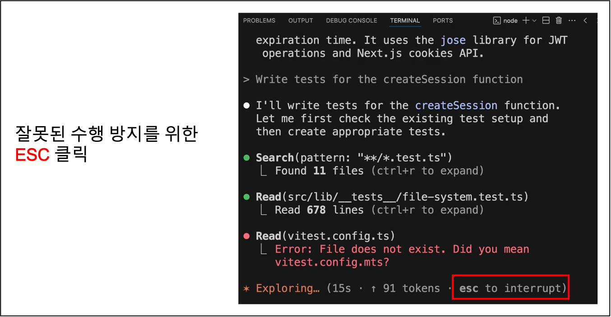
_중단을 위한 ESC 키_

### 2. 5. 2 Escape와 메모리(#) 결합하기
`Escape` 기법의 강력한 활용 중 하나는 반복적인 오류를 수정하는 것입니다. 
Claude가 서로 다른 대화에서 같은 실수를 반복적으로 할 때:

- `Escape`를 눌러 현재 응답을 중단합니다.
- `#` 단축키를 사용하여 올바른 접근법에 대한 메모리를 추가합니다.
- 수정된 정보로 대화를 계속합니다.

이렇게 하면 Claude가 프로젝트의 향후 대화에서 같은 오류를 범하는 것을 방지할 수 있습니다.

#### 예 : ESC로 중지 후 바로 올바른 파일명을 단축키 `#`을 이용하여 메모리에 추가

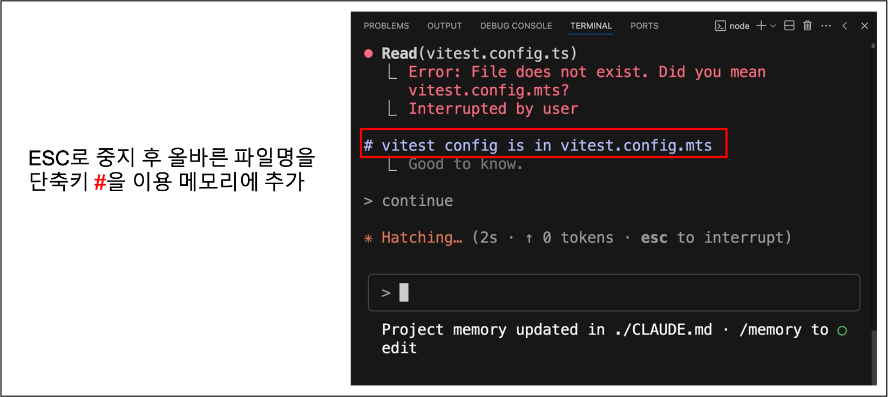
_올바른 파일명을 #을 이용 메모리 추가_

### 2. 5. 3 대화 되감기 (ESC 연속 두 번 클릭)
긴 대화 중에는 관련성이 없거나 주의를 산만하게 하는 컨텍스트가 누적될 수 있습니다. 
예를 들어, Claude가 오류를 만나고 디버깅에 시간을 많이 보낸다면, Claude와 주고받은 논의가 다음 작업에는 유용하지 않을 수 있습니다.

`Escape`를 두 번 눌러 대화를 되감을 수 있습니다. 이렇게 하면 보낸 모든 메시지가 표시되어 이전 지점으로 돌아가서 그곳부터 계속할 수 있습니다. 
이 기법은 다음에 도움이 됩니다:

- 가치 있는 컨텍스트 유지 (Claude의 코드베이스 이해 등)
- 주의를 산만하게 하거나 관련 없는 대화 기록 제거
- Claude가 현재 작업에 집중하도록 유지

#### 예: 되감기 실행 화면

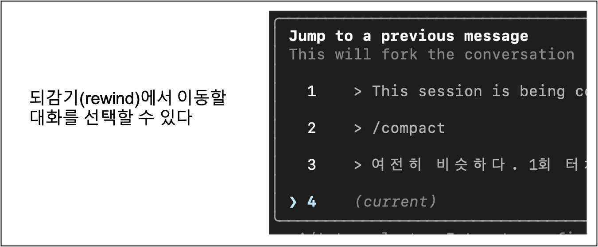
_되감기 실행 화면_

#### 예: 디버깅 완료 후 에러 관련 대화 제외하기 위해 되감기

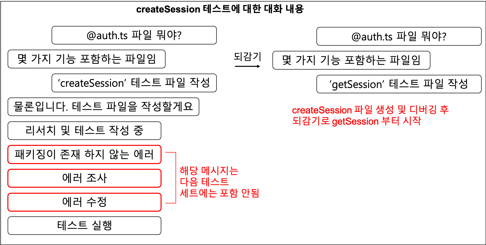
_대화 대감기_

### 2. 5. 4 컨텍스트 관리 명령어
Claude는 대화 컨텍스트를 효과적으로 관리하는 데 도움이 되는 여러 명령어를 제공합니다:

#### `/compact`
`/compact` 명령어는 Claude가 학습한 핵심 정보를 보존하면서 전체 대화 기록을 요약합니다. 
다음과 같은 경우에 이상적입니다:

- Claude가 프로젝트에 대한 가치 있는 지식을 얻었을 때
- 관련 작업을 계속하고 싶을 때
- 대화가 길어졌지만, 중요한 컨텍스트를 포함하고 있을 때

Claude가 현재 작업에 대해 많이 학습했고 다음 관련 작업으로 넘어갈 때 그 지식을 유지하고 싶다면 `compact`를 사용합니다.

#### `/clear`
`/clear` 명령어는 대화 기록을 완전히 제거하여 새로운 시작을 제공합니다. 
다음과 같은 경우에 가장 유용합니다:

- 완전히 다른, 관련 없는 작업으로 전환할 때
- 현재 대화 컨텍스트가 새 작업에서 Claude를 혼란스럽게 할 수 있을 때
- 이전 컨텍스트 없이 처음부터 시작하고 싶을 때

### 2. 5. 5 이러한 기법을 언제 사용할지
이러한 대화 제어 기법은 다음과 같은 상황에서 특히 가치가 있습니다:

- 컨텍스트가 어수선해질 수 있는 장기간 대화
- 이전 컨텍스트가 주의를 산만하게 할 수 있는 작업 전환
- Claude가 반복적으로 같은 실수를 하는 상황
- 특정 구성 요소에 집중을 유지해야 하는 복잡한 프로젝트

`Escape`, `이중 탭 Escape`, `/compact`, `/clear`를 전략적으로 사용하면 개발 워크플로 전반에 걸쳐 Claude를 집중적이고 생산적으로 유지할 수 있습니다. 이것들은 단순한 편의 기능이 아니라 효과적인 AI 지원 개발 세션을 유지하기 위한 필수 도구입니다.


## 2. 6 사용자 정의 명령

Claude Code는 `슬래시`를 입력하여 액세스할 수 있는 내장 명령어와 함께 제공되지만, 자주 실행하는 반복적인 작업을 자동화하기 위해 자신만의 `사용자 정의 명령어`를 만들 수도 있습니다.

### 2. 6. 1 사용자 정의 명령어 생성하기
사용자 정의 명령어를 생성하려면 프로젝트에서 특정 폴더 구조를 설정해야 합니다:

1. 프로젝트 디렉터리에서 `.claude` 폴더를 찾습니다
2. 그 안에 `commands`라는 새 디렉터리를 생성합니다
3. 원하는 명령어 이름으로 새 마크다운 파일을 생성합니다 (예: `audit.md`)

파일명이 명령어 이름이 됩니다. 따라서 `audit.md`는 `/audit` 명령어를 생성합니다.

#### 예: audit 명령어
다음은 프로젝트 종속성의 취약점을 감사하는 사용자 정의 명령어의 실용적인 예시입니다:

이 audit 명령어는 세 가지 작업을 수행합니다:

1. `npm audit`를 실행하여 취약한 설치된 패키지를 찾습니다.
2. `npm audit fix`를 실행하여 업데이트를 적용합니다.
3. 테스트를 실행하여 업데이트가 아무것도 손상하지 않았는지 확인합니다.

```
Your goal is to update any vulnerable dependencies.

Do the following:

1. Run 'npm audit' to find vulnerable installed packages in this project
2. Run 'npm audit fix' to apply updates
3. Run tests and verify the updates didn't break anything
```

명령어 파일을 생성한 후, Claude Code가 새 명령어를 인식하도록 하려면 Claude Code를 다시 시작해야 합니다.

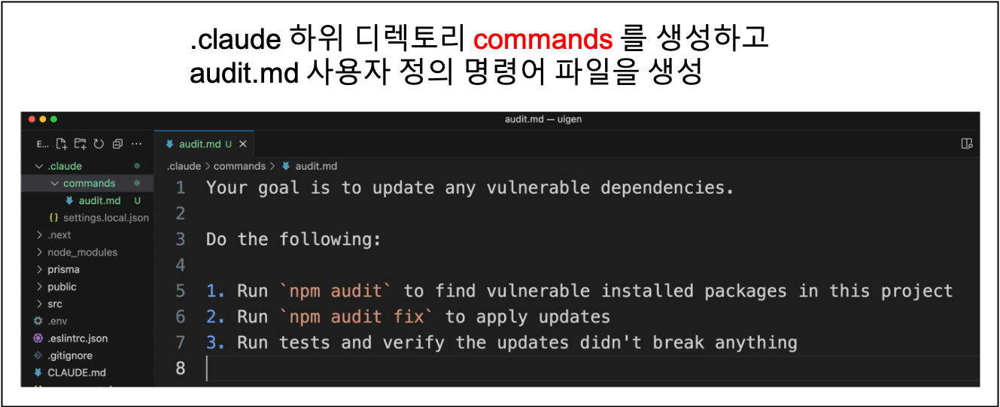
_사용자 정의 명령어 파일 생성_

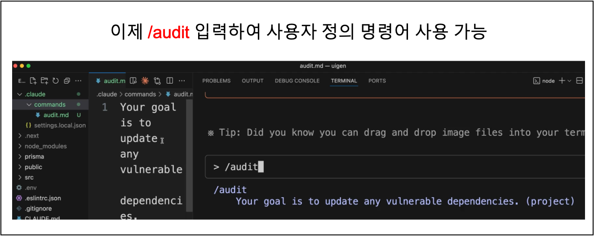
_사용자 정의 명령어 실행_

#### 예: 인수가 있는 명령어
사용자 정의 명령어는 `$ARGUMENTS` 플레이스홀더를 사용하여 인수를 받을 수 있습니다. 이렇게 하면 훨씬 더 유연하고 재사용 가능해집니다.

예를 들어, `write_tests.md` 명령어는 다음을 포함할 수 있습니다:

```
Write comprehensive tests for: $ARGUMENTS

Testing conventions:
* Use Vitests with React Testing Library
* Place test files in a __tests__ directory in the same folder as the source file
* Name test files as [filename].test.ts(x)
* Use @/ prefix for imports

Coverage:
* Test happy paths
* Test edge cases
* Test error states
```

그런 다음 파일 경로와 함께 이 명령어를 실행할 수 있습니다:

```
/write_tests the use-auth.ts file in the hooks directory
```

인수는 파일 경로만 특정하진 않습니다. Claude에게 작업에 대한 컨텍스트와 방향을 제공하기 위해 전달하고 싶은 모든 문자열이 될 수 있습니다.

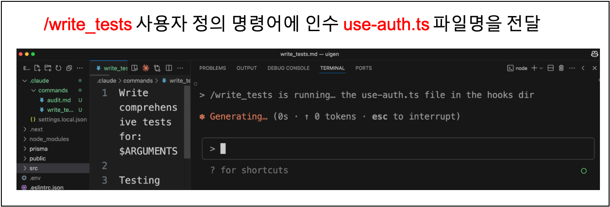
_인수가 있는 사용자 정의 명령어 실행_

### 2. 6. 2 주요 이점
- 자동화 : 반복적인 워크플로를 단일 명령어로 변환
- 일관성 : 매번 동일한 단계가 수행되도록 보장
- 컨텍스트 : 프로젝트에 대한 특정 지시 사항과 규칙을 Claude에게 제공
- 유연성 : 인수를 사용하여 명령어가 다양한 입력과 함께 작동하도록 함

`사용자 정의 명령어`는 테스트 스위트 실행, 코드 배포, 또는 팀의 규칙을 따르는 보일러 플레이트 생성과 같은 프로젝트별 워크플로에 특히 유용합니다.

## 2. 7  Claude Code가 포함된 MCP 서버

`MCP(Model Context Protocol)` 서버를 추가하여 Claude Code의 기능을 확장할 수 있습니다. 
이러한 서버는 원격으로 또는 머신에서 로컬로 실행되며, Claude에게 일반적으로는 갖지 못할 새로운 도구와 능력을 제공합니다.

가장 인기 있는 MCP 서버 중 하나는 Playwright로, Claude에게 `웹 브라우저를 제어`할 수 있는 능력을 제공합니다. 
이는 웹 개발 워크플로에 강력한 가능성을 열어줍니다.

### 2. 7. 1  Playwright MCP 서버 설치하기
Claude Code에 Playwright 서버를 추가하려면, 터미널에서 다음 명령어를 실행하세요 (Claude Code 내부가 아닌):

```bash
claude mcp add playwright npx @playwright/mcp@latest
```

이 명령어는 두 가지 작업을 수행합니다:

- MCP 서버의 이름을 "playwright"로 지정합니다
- 머신에서 서버를 로컬로 시작하는 명령어를 제공합니다

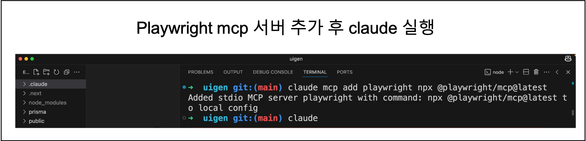
_MCP 서버 추가하기_


### 2. 7. 2  권한 관리
MCP 서버 도구를 처음 사용할 때, Claude는 매번 권한을 요청합니다. 이러한 권한 프롬프트가 번거롭다면, 설정을 편집하여 서버를 사전 승인할 수 있습니다.

`.claude/settings.local.json` 파일을 열고 allow 배열에 서버를 추가하세요:

```json
{
   "permissions": {
     "allow": ["mcp__playwright"],
     "deny": []
   }
}
```
`mcp__playwright`의 이중 밑줄로 권한 설정하고 싶은 mcp 서버를 설정하면 Claude가 매번 권한을 요청하지 않고 Playwright 도구를 사용할 수 있습니다.

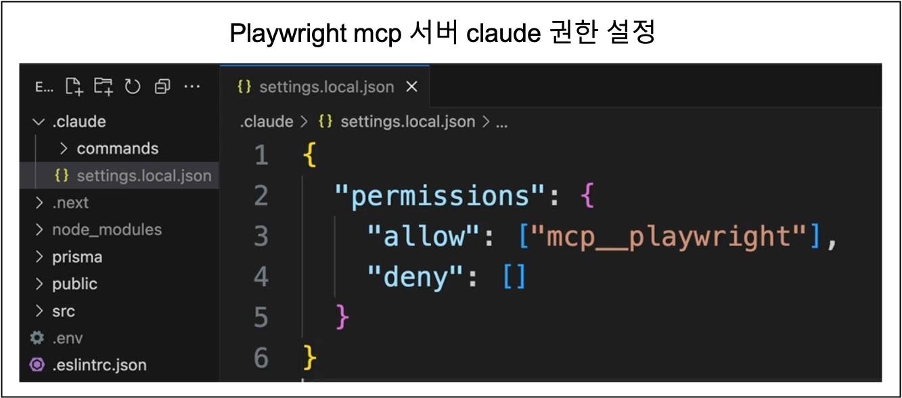
_MCP 서버 Claude 권한 설정_

### 2. 7. 3  예: 컴포넌트 생성 개선
다음은 Playwright MCP 서버가 개발 워크플로를 어떻게 개선할 수 있는지 보여주는 실제 예시입니다. 
수동으로 테스트하고 프롬프트를 조정하는 대신, Claude가 다음을 수행하도록 할 수 있습니다:

- 브라우저를 열고 애플리케이션으로 이동
- 테스트 컴포넌트 생성
- 시각적 스타일링과 코드 품질 분석
- 관찰한 내용을 바탕으로 생성 프롬프트 업데이트
- 개선된 프롬프트로 새 컴포넌트 테스트

예를 들어, Claude에게 다음과 같이 요청할 수 있습니다:

Claude는 브라우저 도구를 사용하여 앱과 상호작용하고, 생성된 출력을 검사한 다음, 더 독창적이고 창의적인 디자인을 장려하도록 프롬프트 파일을 수정합니다.

> "localhost:3000으로 이동하여 기본 컴포넌트를 생성하고, 스타일링을 검토한 후, @src/lib/prompts/generation.tsx의 생성 프롬프트를 업데이트하여 앞으로 더 나은 컴포넌트를 생성하도록 하세요."

```
Your goal is to improve the component generation prompt at @src/lib/prompts/generation.tsx. Here's how:\
\
1. Open a browser and navigate to localhost:3000\
2. Request a basic component to be generated\
3. Review the generated component and its source codel\
4. Identify areas for improvement\
5. Update the prompt to produce better components going forward.\
\
For now, only evaluate visual styling aspects. We don't want components generated that look like typical tailwindess components - we want something more original.
```

### 2. 7. 4  결과와 이점
MCP 기반 접근법은 훨씬 더 좋은 결과를 가져올 수 있습니다. 
일반적인 보라색에서 파란색으로의 그러데이션과 표준 Tailwind 패턴 대신, Claude는 다음을 추천하여 프롬프트를 업데이트할 수 있습니다:

- 따뜻한 일몰 그러데이션 (주황색-분홍색-보라색)
- 깊은 바다 테마 (청록색-에메랄드-시안)
- 비대칭 디자인과 중첩적인 요소
- 창의적인 공간과 색다른 레이아웃

주요 장점은 Claude가 코드뿐만 아니라 실제 시각적 출력을 볼 수 있고, 이를 통해 스타일링 개선에 대해 훨씬 더 정보에 기반한 결정을 내릴 수 있습니다.


_Playwright MCP를 통한 시각적 출력 분석 후 제안_

### 2. 7. 5  다른 MCP 서버 탐색하기
Playwright는 MCP 서버는 한 예일 뿐이며, 에코 시스템에는 다음 기능을 위한 MCP 서버들이 포함되어 있습니다:

- 데이터베이스 상호작용
- API 테스팅 및 모니터링
- 파일 시스템 작업
- 클라우드 서비스 통합
- 개발 도구 자동화

특정 개발 요구사항에 맞는 MCP 서버를 찾아보세요. MCP는 Claude를 단순한 코드 어시스턴트에서 전체 도구 체인과 상호작용을 할 수 있는 포괄적인 개발 파트너가 될 수 있습니다.

## 2. 8  Github 통합

Claude Code는 Claude가 GitHub Actions 내에서 실행될 수 있게 해주는 공식 `GitHub 통합`을 제공합니다. 

이 통합은 두 가지 주요 워크플로를 제공합니다: 
- 이슈와 풀 리퀘스트에 대한 멘션 지원 
- 자동 풀 리퀘스트 리뷰

### 2. 8. 1 통합 설정하기
시작하려면 Claude에서 `/install-github-app`을 실행합니다. 

이 명령어는 다음 설정 과정을 포함합니다:

- GitHub에 Claude Code 앱 설치
- API 키 추가
- 워크플로 파일과 함께 풀 리퀘스트 자동 생성

생성된 풀 리퀘스트는 저장소에 두 개의 GitHub Actions를 추가합니다. 
병합되면 `.github/workflows` 디렉터리에 워크플로 파일이 생깁니다.

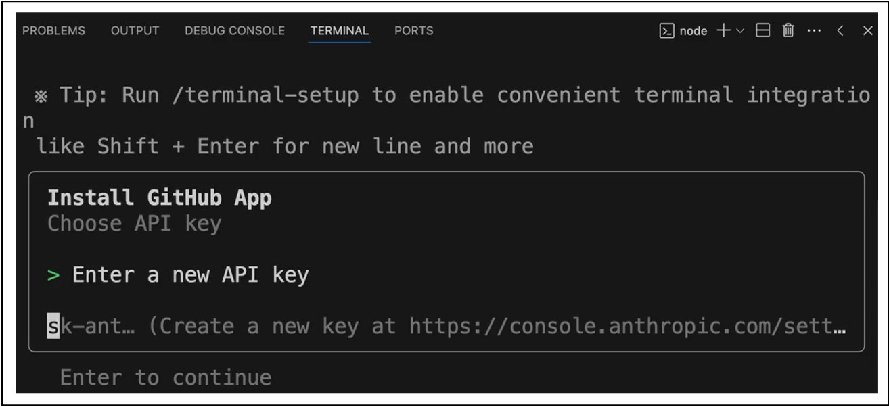
_API 키 설정_

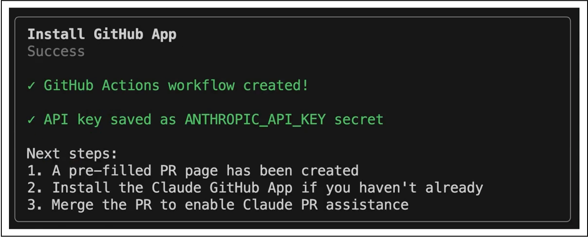
_Github Action workflow, API 설정 완료_


### 2. 8. 2 기본 GitHub Actions
통합은 두 가지 주요 워크플로를 제공합니다:

#### 멘션 액션
`@claude`를 사용하여 모든 이슈나 풀 리퀘스트에서 Claude를 멘션 할 수 있습니다. 
멘션 되면 Claude는 다음을 수행합니다:

- 요청을 분석하고 작업 계획을 생성합니다.
- 코드베이스에 대한 전체 액세스 권한으로 작업을 실행합니다.
- 이슈나 풀 리퀘스트에서 직접 결과로 응답합니다.

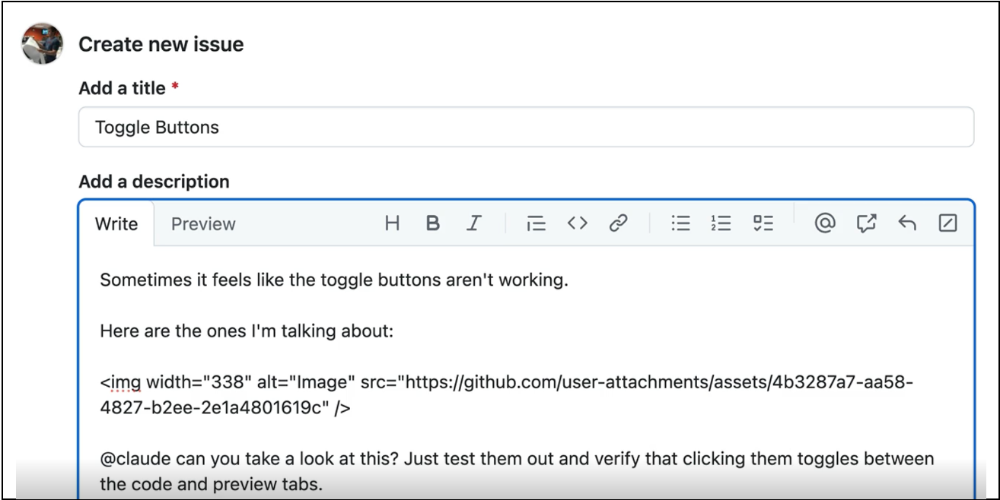
_Github 멘션을 통한 이슈 생성_

#### 풀 리퀘스트 액션
풀 리퀘스트를 생성할 때마다 Claude가 자동으로 하기 항목을 수행합니다:

- 제안된 변경 사항을 검토합니다
- 수정사항의 영향을 분석합니다
- 풀 리퀘스트에 상세한 보고서를 게시합니다

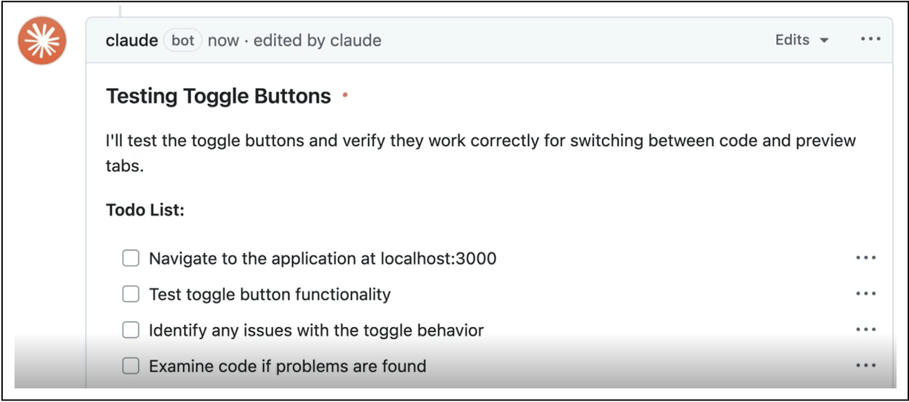
_Claude Code - Pull Request 보고서 게시 자동 수행_

### 2. 8. 3 워크플로 사용자 정의
초기 풀 리퀘스트를 병합한 후, 프로젝트 요구사항에 맞게 워크플로 파일을 사용자 정의할 수 있습니다. 
멘션 워크플로를 향상하는 방법은 다음과 같습니다:

#### 프로젝트 설정 추가
Claude가 실행되기 전에 환경을 준비하는 단계를 추가할 수 있습니다:

`.github > workflows > claude.yml 파일 설정`

```yaml
- name: Project Setup
  run: |
    npm run setup
    npm run dev:daemon
```

#### 사용자 정의 지시 사항
프로젝트 설정에 대한 컨텍스트를 Claude에게 제공합니다:

```yaml
custom_instructions: |
  The project is already set up with all dependencies installed.
  The server is already running at localhost:3000. Logs from it
  are being written to logs.txt. If needed, you can query the
  db with the 'sqlite3' cli. If needed, use the mcp__playwright
  set of tools to launch a browser and interact with the app.
```

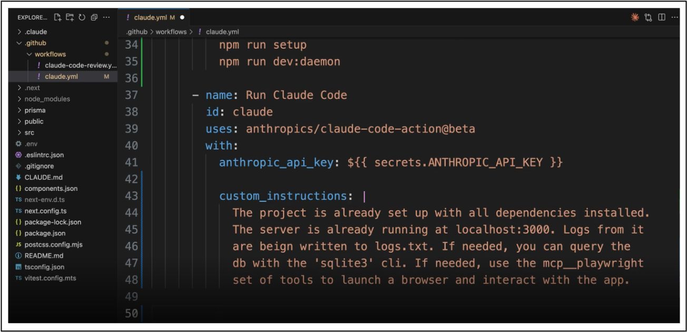
_Github workflow 사용자 정의_

## 2. 9  MCP 서버 구성
Claude에게 추가 기능을 제공하기 위해 MCP 서버를 구성할 수 있습니다:

```yaml
mcp_config: |
  {
    "mcpServers": {
      "playwright": {
        "command": "npx",
        "args": [
          "@playwright/mcp@latest",
          "--allowed-origins",
          "localhost:3000;cdn.tailwindcss.com;esm.sh"
        ]
      }
    }
  }
```

### 2. 9. 1 도구 권한
GitHub Actions에서 Claude를 실행할 때는 허용된 모든 도구를 명시적으로 나열해야 합니다. 이 설정은 MCP 서버를 사용할 때 중요합니다.

```
allowed_tools: "Bash(npm:*),Bash(sqlite3:*),mcp__playwright__browser_snapshot,mcp__playwright__browser_click,..."
```

로컬 개발과 달리 GitHub Actions에서는 권한에 대한 단축키가 없습니다. 그래서 각 MCP 서버의 각 도구를 개별적으로 나열해야 합니다.

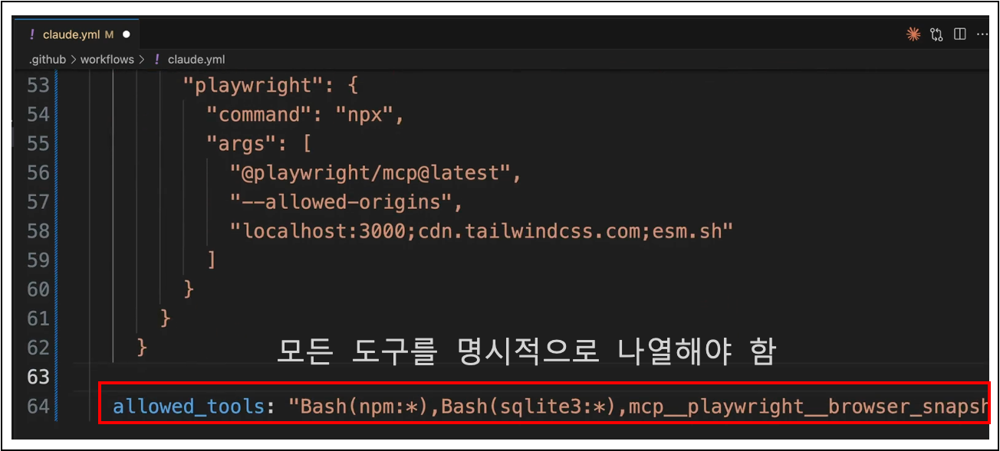
_Claude 실행할 때 허용 도구 나열_

### 2. 9. 2 모범 사례
Claude의 GitHub 통합을 설정할 때 다음 사례를 참조하십시오:

- 기본 워크플로로 시작하여 점차 사용자 정의를 확대하세요.
- 프로젝트별 컨텍스트를 제공하기 위해 사용자 정의 지시 사항을 사용하세요.
- MCP 서버를 사용할 때 도구 권한을 명시적으로 설정하세요.
- 복잡한 작업 전에 간단한 작업으로 워크플로를 테스트하세요.
- 추가 단계를 구성할 때 프로젝트의 특정 요구사항을 고려하세요.

GitHub 통합은 Claude를 개발 어시스턴트에서 작업을 처리하고, 코드를 검토하며, GitHub 워크플로 내에서 직접 인사이트를 제공할 수 있는 자동화된 팀원으로 구성할 수 있습니다.


## 2. 10 정리
개발 환경에서 Claude와 함께 작업할 때, 기존 프로젝트를 변경해야 하는 경우가 자주 있습니다. Claude Code의 스크린숏을 통한 시각적 소통과 Claude의 고급 추론 기능 활용을 포함하여 효과적으로 변경 사항을 구현하는 실용적인 기법들을 다룰 수 있습니다.

다음 포스팅에서는 훅(hook)과 SDK를 알아보겠습니다.
