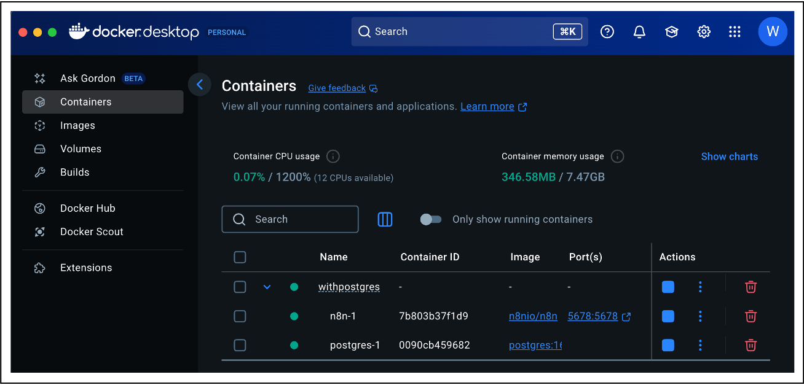
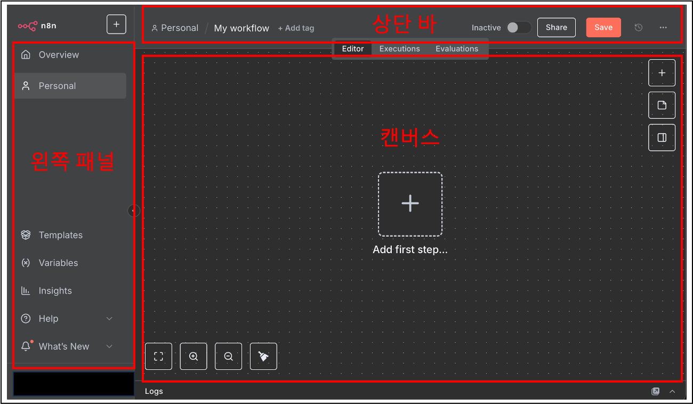
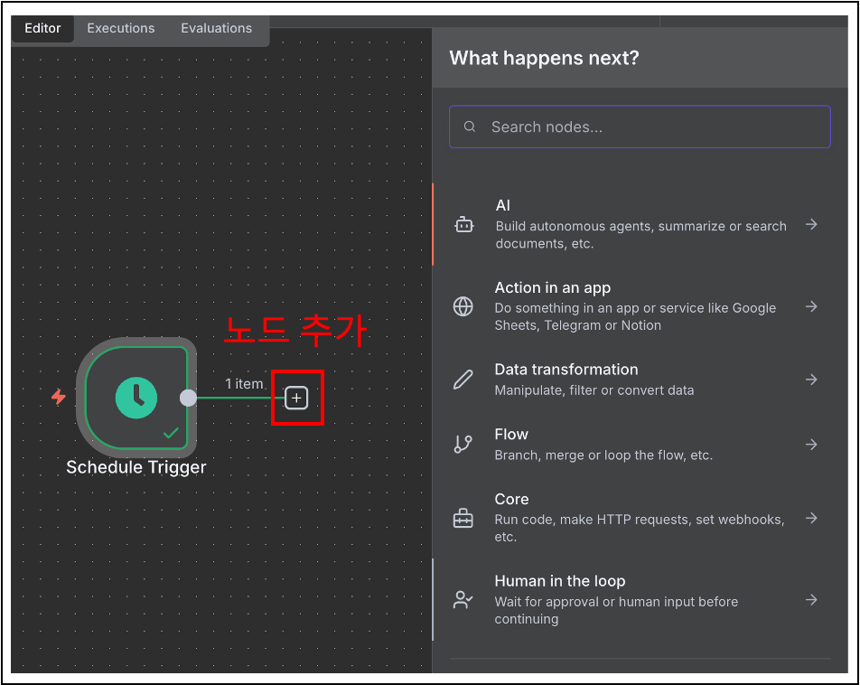
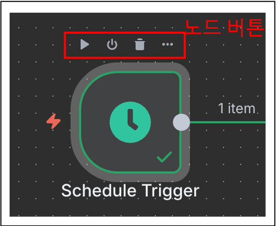

## 1. n8n 이란
[n8n](https://docs.n8n.io/){: target="_blank"}은 AI 기능과 비즈니스 프로세스 자동화를 결합한 공정-코드([Fair-code](https://faircode.io/){: target="_blank"}) 라이선스 워크플로 자동화 도구입니다.
`n8n`을 사용하면 모든 앱을 API와 연결하고, 코드를 거의 또는 전혀 사용하지 않고 해당 데이터를 조작할 수 있습니다.

다음과 같은 주요 기능을 제공합니다.
- `사용자 정의 가능`: 매우 유연한 워크플로와 사용자 정의 노드를 구축하는 옵션을 제공합니다.
- `편리함`: `npm`이나 `Docker`를 사용하여 `n8n`을 쉽게 사용 가능하고, 엔터프라이즈 버전을 통하여 호스팅 가능합니다.
- `개인정보 보호 중심`: 개인정보 보호 및 보안을 위해 n8n을 셀프 호스팅할 수 있습니다.

## 2. 플랫폼 구성 방식
`n8n` 설정하는 사용 목적에 따라 크게 3가지의 플랫폼 설정을 제공합니다.

구성은 `셀프 호스트` 기준으로 진행합니다.

- [n8n Cloud](https://docs.n8n.io/choose-n8n/#:~:text=to%20use%20it%3A-,n8n%20Cloud,-%3A%20hosted%20solution%2C%20no){: target="_blank"} : 호스팅 솔루션으로 아무것도 설치할 필요가 없습니다.
- [셀프 호스트](https://docs.n8n.io/choose-n8n/#:~:text=to%20install%20anything.-,Self%2Dhost,-%3A%20recommended%20method%20for){: target="_blank"} : 프로덕션이나 맞춤형 사용 사례에 권장되는 방법입니다.
	- [npm](https://docs.n8n.io/choose-n8n/#:~:text=customized%20use%20cases.-,npm,-Docker){: target="_blank"}
	- [도커](https://docs.n8n.io/hosting/installation/docker/){: target="_blank"}
	- [인기 플랫폼을 위한 서버 설정 가이드](https://docs.n8n.io/hosting/installation/server-setups/){: target="_blank"}
- [임베드](https://docs.n8n.io/embed/){: target="_blank"} : n8n 임베드를 사용하면 n8n을 화이트 라벨로 등록하여 자체 제품에 적용할 수 있습니다. 가격 및 지원은 임베드 웹사이트 에서 n8n에 확인 가능합니다.


> **화이트 라벨 (White Label)**
>
> 한 회사가 만든 제품이나 서비스를 다른 회사가 자신들의 브랜드로 바꿔서 판매하는 방식을 의미
{: .prompt-info }

## 3. 사전 필수 설치
먼저 [Docker Desktop](https://docs.docker.com/get-docker/){: target="_blank"}을 설치합니다.
경로에서 해당하는 OS를 설치합니다.

## 4. 구성하기
Docker 또는 Docker Compose로 n8n을 실행할 수 있습니다.

`PostgreSQL 설치를 위해 Docker Compose로 진행합니다.`

### 4.  1  Docker 기반 (참고)
Docker 구성은 참고만 합니다.
#### 4. 1.  1 n8n 실행 

```bash
docker volume create n8n_data
```

```bash
docker run -it --rm \
 --name n8n \
 -p 5678:5678 \
 -e GENERIC_TIMEZONE="Asia/Seoul" \
 -e TZ="Asia/Seoul" \
 -e N8N_ENFORCE_SETTINGS_FILE_PERMISSIONS=true \
 -e N8N_RUNNERS_ENABLED=true \
 -v n8n_data:/home/node/.n8n \
 docker.n8n.io/n8nio/n8n
```
#### 4. 1.  2 PostgreSQL 실행

```bash
docker volume create n8n_data
```

하기 타임존과 PostgreSql 변경을 원할 시 설정 항목은 다른 값으로 수정합니다.
```bash
docker run -it --rm \
  --name n8n \
  -p 5678:5678 \
  -e GENERIC_TIMEZONE="Asia/Seoul" \
  -e TZ="Asia/Seoul" \
  -e N8N_ENFORCE_SETTINGS_FILE_PERMISSIONS=true \
  -e N8N_RUNNERS_ENABLED=true \
  -e DB_TYPE=postgresdb \
  -e DB_POSTGRESDB_DATABASE=n8n_db \
  -e DB_POSTGRESDB_HOST=postgres \
  -e DB_POSTGRESDB_PORT=5432 \
  -e DB_POSTGRESDB_USER=n8nuser \
  -e DB_POSTGRESDB_SCHEMA=public \
  -e DB_POSTGRESDB_PASSWORD=<POSTGRES_PASSWORD> \ 
  -v n8n_data:/home/node/.n8n \
  docker.n8n.io/n8nio/n8n
```

### 4.  2 Docker Compose 사용하여 실행

[Docker Compose with PostgreSQL](https://github.com/n8n-io/n8n-hosting/tree/main/docker-compose/withPostgres){: target="_blank"}을 다운로드하여 .env 파일에 값을 입력합니다.

하기 .env 변경을 원할 시 설정 항목은 다른 값으로 수정합니다.
그리고 `<POSTGRES_PASSWORD>` 적절한 비밀번호를 입력합니다.

**.env 파일 설정**
```
POSTGRES_USER=postgres
POSTGRES_PASSWORD=<POSTGRES_PASSWORD>
POSTGRES_DB=n8n_db

POSTGRES_NON_ROOT_USER=n8nuser
POSTGRES_NON_ROOT_PASSWORD=<POSTGRES_PASSWORD>

```

**docker-compose.yml 구성 보기**
```yaml
version: '3.8'

volumes:
  db_storage:
  n8n_storage:

services:
  postgres:
    image: postgres:16
    restart: always
    environment:
      - POSTGRES_USER
      - POSTGRES_PASSWORD
      - POSTGRES_DB
      - POSTGRES_NON_ROOT_USER
      - POSTGRES_NON_ROOT_PASSWORD
    volumes:
      - db_storage:/var/lib/postgresql/data
      - ./init-data.sh:/docker-entrypoint-initdb.d/init-data.sh
    healthcheck:
      test: ['CMD-SHELL', 'pg_isready -h localhost -U ${POSTGRES_USER} -d ${POSTGRES_DB}']
      interval: 5s
      timeout: 5s
      retries: 10

  n8n:
    image: docker.n8n.io/n8nio/n8n
    restart: always
    environment:
      - DB_TYPE=postgresdb
      - DB_POSTGRESDB_HOST=postgres
      - DB_POSTGRESDB_PORT=5432
      - DB_POSTGRESDB_DATABASE=${POSTGRES_DB}
      - DB_POSTGRESDB_USER=${POSTGRES_NON_ROOT_USER}
      - DB_POSTGRESDB_PASSWORD=${POSTGRES_NON_ROOT_PASSWORD}
    ports:
      - 5678:5678
    links:
      - postgres
    volumes:
      - n8n_storage:/home/node/.n8n
    depends_on:
      postgres:
        condition: service_healthy

```

컨테이너를 실행합니다.
```bash
docker-compose up -d
```

웹 브라우저에서 다음 주소를 복사하여 오픈합니다.
```
http://localhost:5678/
```


_Docker Compose 실행_

## 5. 주요 인터페이스


_주요 인터페이스_

### 5. 1 왼쪽 패널
- **Overview** : 액세스 권한이 있는 모든 워크플로, 자격 증명 및 실행이 포함되어 있습니다. 여기에서 새 워크플로를 만들 수 있습니다.
- **Personal** : 모든 사용자에게 기본 개인 프로젝트가 제공됩니다. 사용자 지정 프로젝트를 만들지 않으면 워크플로와 자격 증명이 여기에 저장됩니다.
- **Project** : 프로젝트를 사용하면 워크플로와 자격 증명을 그룹화할 수 있습니다. 프로젝트 내 사용자에게 역할을 할당하여 해당 사용자의 작업을 제어할 수 있습니다. 단 `Community Edition`에서는 프로젝트 기능을 사용할 수 없습니다.
- **Admin Pannel** : n8n Cloud 전용. n8n 인스턴스 사용량, 청구 및 버전 설정에 액세스합니다.
- **Templates** : 미리 만들어진 워크플로 모음입니다. 일반적인 사용 사례를 시작하기에 좋습니다.
- **Variables** : 워크플로 전반에서 고정 데이터를 저장하고 액세스하는 데 사용됩니다. 이 기능은 `Pro` 및 `Enterprise` 플랜에서만 사용가능합니다.
- **Insights** : 워크플로에 대한 분석과 통찰력을 제공합니다.
- **Help** : n8n 제품 및 커뮤니티에 대한 리소스를 담고 있습니다.
- **What’s New** : 최신 제품 업데이트와 기능을 보여줍니다.

### 5.  2 상단 바
편집기 UI의 상단 표시줄에는 다음 정보가 포함되어 있습니다.

- **Workflow Name** : 기본적으로 n8n은 새 워크플로의 이름을 "내 워크플로"로 지정하지만 언제든지 이름을 편집할 수 있습니다.
- **+ Add Tag** : 태그를 사용하면 범주, 사용 사례 또는 관련 항목별로 워크플로를 정리할 수 있습니다. 태그는 선택 사항입니다.
- **Inactive/active toggle** : 이 버튼은 현재 워크플로를 활성화하거나 비활성화합니다. 기본적으로 워크플로는 비활성화되어 있습니다.
- **Share** : Starter, Pro, Enterprise 플랜에서 워크플로를 다른 사람들과 공유하고 협업할 수 있습니다.
- **Save** : 이 버튼을 누르면 현재 작업 흐름이 저장됩니다.
- **History** : 작업 흐름을 저장하면 이전 버전을 여기에서 볼 수 있습니다.

### 5.  3 캔버스
캔버스는 편집기 UI의 회색 점선 그리드 배경입니다. 여러 아이콘과 다양한 기능을 가진 노드가 표시됩니다.

- **캔버스 좌측 아래** : 캔버스를 화면에 고정하여 확대/축소 버튼, 캔버스를 확대/축소 버튼, 확대/축소를 재설정 버튼, 화면에 있는 노드를 정리하는 버튼으로 구성
- **(첫 번째 노드를 추가하면) 워크플로를 실행하는 버튼** : 이 버튼을 클릭하면 n8n이 캔버스의 모든 노드를 순서대로 실행합니다.
- **+ 기호** : 클릭하면 노드 패널이 열립니다.
- **메모 아이콘** : 클릭하면 캔버스에 스티커 메모가 추가됩니다. (오른쪽 상단 + 아이콘에 마우스를 올리면 표시됨)
- **"Add first step..."**라는 텍스트가 있는 점선 사각형 : 클릭 후 첫 번째 노드를 추가합니다.
- **캔버스 오른쪽에 'Ask Assistant'** : AI Assistant에게 워크플로 구축에 대한 도움을 요청할 수 있습니다. (Community는 없음)

### 5.  4 노드
노드는 서로 다른 기능을 수행하는 구성 요소로 생각할 수 있으며, 이 구성 요소를 모두 합치면 작동하는 기계, 즉 자동화된 워크플로를 구성합니다.
n8n은 노드를 기능에 따라 네 가지 유형으로 분류합니다.

- 앱 또는 액션 노드는 데이터를 추가, 삭제, 편집하고, 외부 데이터를 요청 및 전송하며, 다른 시스템에서 이벤트를 트리거 합니다. 이러한 노드의 전체 목록은 액션 노드 라이브러리를 참조하세요 .
- 트리거 노드는 워크플로를 시작하고 초기 데이터를 제공합니다. 트리거 노드 목록은 트리거 노드 라이브러리를 참조하세요.
- 핵심 노드는 트리거 노드 또는 앱 노드일 수 있습니다. 대부분의 노드가 특정 외부 서비스에 연결되는 반면, 핵심 노드는 로직, 스케줄링 또는 일반 API 호출과 같은 기능을 제공합니다. 핵심 노드의 전체 목록은 핵심 노드 라이브러리를 참조하세요.
- 클러스터 노드는 주로 AI 워크플로에서 기능을 제공하기 위해 함께 작동하는 노드 그룹입니다. 자세한 내용은 클러스터 노드를 참조하세요.

### 5.  5 노드 찾기
편집기 UI 오른쪽의 노드 패널에서 사용할 수 있는 모든 노드를 확인할 수 있습니다. 

노드 패널을 여는 방법은 세 가지가 있습니다.

- 캔버스 오른쪽 상단에 있는 `+` 아이콘을 클릭합니다.
- 캔버스에서 기존 노드(다른 노드를 추가하려는 노드)의 오른쪽에 있는 `+` 아이콘을 클릭합니다.
- `Tab` 키를 클릭하세요.

노드 패널에서 첫 번째 노드를 추가할 때 다양한 트리거 노드 범주가 표시됩니다. 트리거 노드를 추가하면 노드 패널이 `Advanced AI`, `Actions in an App`, `Data transformation`, `Flow`, `Core`, 그리고 `Human in the loop`으로 변경됩니다.

특정 노드를 찾으려면 노드 패널 상단에 있는 검색 입력을 사용하세요.


_기존 노드 + 아이콘 클릭하여 노드 찾기_

### 5.  6 노드 추가하기
캔버스에 노드를 추가하는 방법은 두 가지가 있습니다.

- 노드 패널에서 원하는 노드를 선택하면, 새 노드는 캔버스에서 선택한 노드에 자동으로 연결됩니다.
- 노드 패널에서 캔버스로 노드를 끌어다 놓습니다.

### 5.  7 노드 버튼 기능들
노드에 마우스를 올려놓으면 맨 위에 세 개의 아이콘이 나타납니다.

- 노드 실행(재생 아이콘)
- 노드 비활성화/활성화(전원 아이콘)
- 노드 삭제(휴지통 아이콘)
- 다른 노드 옵션이 포함된 상황에 맞는 메뉴를 여는 줄임표 아이콘도 있습니다.


_노드 버튼 기능_

## 6. 정리
`n8n`은 프로덕트에서는 `Public Cloud` 및 `n8n Enterprise` 버전을 고려할 수 있습니다.

실습에서는 Docker 기반도 가능하나 `PostgreSQL` 실행을 위해 `Docker Compose` 기반 셀프 호스팅으로 구축하여 실행했습니다. 마지막으로 `노-코드` 기반의 주요 인터페이스를 확인했습니다.

다음 포스팅에서는 `간단한 워크플로`를 구축하겠습니다.

## References
- [n8n 공식 문서](https://docs.n8n.io/){: target="_blank"}
- [n8n Self hosted AI Starter Kit](https://github.com/n8n-io/self-hosted-ai-starter-kit){: target="_blank"}